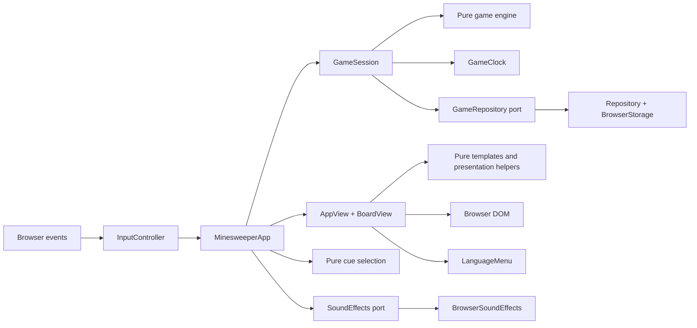

# Reading the code: an OOP shell around a functional core

All game behavior is written in TypeScript. The `.mjs` files under `scripts/` are development, build, and measurement tools. The application uses objects for state ownership and resource lifetimes, and pure functions for rules, derived values, and HTML generation.

## Responsibilities



| Module                            | Ownership and boundary                                                                                                                                                                                |
| --------------------------------- | ----------------------------------------------------------------------------------------------------------------------------------------------------------------------------------------------------- |
| `src/main.ts`                     | Composition only: find the mount point, create browser adapters, restore preferences, and construct the application.                                                                                  |
| `src/game/engine.ts`              | Immutable `Game` values and pure transitions. Placement, reveal targets, flood fill, win detection, and snapshot validation are separate functions.                                                   |
| `src/application/game-session.ts` | The current game and difficulty, pause/dialog lifecycle, persistence ordering, and result creation. It calls the engine rather than implementing board rules.                                         |
| `src/application/game-clock.ts`   | Accumulated time and active intervals. Its injected monotonic clock makes pause/resume behavior testable without sleeping.                                                                            |
| `src/storage.ts`                  | The `GameRepository` implementation: typed preferences, score ordering, migration, and storage failures. JSON decoding lives in `src/persistence/`; the port is declared in `src/types/storage.d.ts`. |
| `src/platform/browser.ts`         | Browser time, randomness, identifiers, dates, and deferred access to `localStorage`.                                                                                                                  |
| `src/ui/minesweeper-app.ts`       | Application commands and presentation coordination. It chooses which dialog to show and when to redraw.                                                                                               |
| `src/ui/input-controller.ts`      | Delegated input listeners, keyboard routing, long-press recognition, and gesture cancellation. An `AbortController` owns listener teardown.                                                           |
| `src/ui/app-view.ts`              | The application DOM and native dialog presentation. It receives a session snapshot instead of changing business state.                                                                                |
| `src/ui/board-view.ts`            | Cell elements, visible-cell rendering, and roving keyboard focus.                                                                                                                                     |
| `src/ui/templates.ts`             | Pure HTML-producing functions, including small helpers for tabs, help steps, records, and player-name forms.                                                                                          |
| `src/ui/presentation.ts`          | Pure time formatting, escaping, cell descriptions, status labels, and keyboard geometry.                                                                                                              |

## Special-mode boundaries

The [mode design record](game-modes.md) specifies all approved rulesets and their delivery status. `GameRouter` owns exactly one mounted game, checkpoints it before switching, and keeps `ruleset` separate from classic difficulty. It shares browser preferences and audio conventions, not mutable game state.

`game/expedition.ts` owns route connectivity, frontier legality, tools, relic offers and camp purchase rules. `game/twin.ts` partitions one shuffled candidate list into two disjoint mine layouts and resolves paired outcomes. `game/variant-board.ts` provides deterministic shuffling and construction from an explicit mine set; classic seed/layout behavior remains unchanged.

`ExpeditionSession` and `TwinSession` own accepted-action journals and result settlement. `VariantRepository` stores independent versioned envelopes, while `variant-decoders.ts` constructs concrete values from the shared JSON reader. Restoring replays validated commands through pure rules, recomputing hidden cells and earned resources instead of trusting serialized game objects. Expedition settlement updates camp and removes the active run in one write. Journal replay is bounded and rejects illegal transitions.

`VariantApp` coordinates the active special session. `VariantInput` decodes browser attributes into `VariantCommand` and manages abortable event listeners. `VariantView` owns its language menu, native confirmation dialog, shared `BoardView` instances, focus restoration, and coordinate/landmark decoration. `variant-templates.ts` and `variant-copy.ts` produce localized presentation without mutating sessions. `variants.d.ts` and `variant-ui.d.ts` declare the complete domain, persistence and input contracts.

Special modes use move counts rather than clocks. They cover the board on backgrounding; classic timed games retain their existing pause and restored-game rules. Special-mode touch input uses an explicit reveal/flag selector. Route frontiers, safe treasure landmarks and purchased row scans are intentional public information. Twin partner highlights use coordinates only, never hidden mine truth.

## A classic reveal, from input to saved state

Inter-floor expedition choices use a dedicated `RelicDialog`, which owns modal visibility and focus independently of confirmation dialogs. The view automatically opens pending rewards after a floor transition or journal recovery; the application routes selections through the existing session. See [reward dialogs and board scrolling](reward-dialog.md) for lifecycle rules and browser regression checks.

Named contracts live in `src/types/*.d.ts`: `game.d.ts` describes engine values, `session.d.ts` describes injected services and snapshots, and `storage.d.ts` declares the repository port and persisted formats. Localization, icon, and UI contracts have their own modules. Use `import type` when consuming them; do not introduce global ambient application declarations.

Persistence flows through `src/persistence/json-reader.ts` and `decoders.ts`. The reader contains primitive JSON shape checks. Decoders construct specific contracts before `Repository` passes them to the application or engine. The engine's `restore(GameSnapshot)` still checks gameplay invariants and regenerates mines and clues. It does not parse arbitrary input.

UI input follows the same direction: `input-parser.ts` decodes strings and `FormData` into `UiCommand`, `NavigationKey`, and `FormSubmission`. The controller can switch on a form's discriminant without probing a dynamic property bag. Numeric domain bounds remain checked before a custom board replaces the active game.

1. `InputController` converts a mouse, touch, or keyboard action into a cell command.
2. `MinesweeperApp` asks `GameSession` to apply that command.
3. `GameSession` rejects paused/dialog-blocked actions and calls `act(game, action)`.
4. The engine returns a new game value. A rejected action returns the original reference.
5. The session starts or stops its clock, records a preset win exactly once, and saves progress in that order.
6. The app passes the resulting state to the view. A completed game opens a result dialog.

The engine receives its seed as data. It never reads browser randomness, clocks, the DOM, or storage. Local mutation inside a shuffle or flood-fill queue does not escape the function; previously returned game values remain unchanged.

## Lifecycle rules

The board viewport is an inline-size CSS container. Cell width derives from its content width, column count, gap, and an 18 px lower bound; the same value controls height, icons, and label size. Wide boards can take the full layout row before scrolling becomes necessary. `AppView` owns a `ResizeObserver` for the scrolling hint and disconnects it on remount/disposal. Focused cells establish a higher paint order within an isolated board, keeping the outline visible across row boundaries.

`InteractionCue` describes navigation, editing, confirmation, dismissal, and blocked-action feedback. Input and menu adapters emit those intents through callbacks, while the app owns gameplay cues and the mute setting. Native form validation and dialog cancellation have their own event paths. `cuePriority` ensures a gameplay result can replace incidental UI feedback emitted earlier in the same gesture. Rendering, automatic saving, and background lifecycle work remain silent.

`LanguageMenu` owns the flyout's radio selection, roving focus, Escape handling, and outside-pointer/focus dismissal. Its abortable listeners are released before the shell is replaced. Locale resolution is a pure function: supported URL override, saved explicit preference, primary browser locale, then English. Selecting a locale updates the URL and storage before rebuilding the labels and restoring focus to the new trigger.

Audio contracts live in `src/types/audio.d.ts`. `cueForMove` and `notesForCue` are pure functions; game rules do not know about audio. `BrowserSoundEffects` implements the injected `SoundEffects` port and owns lazy activation, bounded polyphony, pending-resume cancellation, and context teardown. `scheduleTone` owns each oscillator/gain envelope and also accepts an offline context for rendering verification. Touch input unlocks audio on pointer-down so the delayed long-press action can produce a cue. Rejected moves receive a blocked-action cue; a successful action produces one gameplay cue regardless of its flood-fill size, and final outcomes take priority.

- Flags before the first reveal do not generate the board or start time.
- Restored games begin paused so loading a page cannot add time before the player resumes.
- A dialog resumes a game only if that dialog introduced the pause. It does not override a user pause.
- Leaving the page cancels automatic dialog resume, including when the dialog had already paused the board.
- Difficulty changes save the old game before loading the selected slot. Invalid custom dimensions are rejected before replacing state.
- Restarting clears the previous result, clock interval, dialog ownership, focus, and pending long press.
- Disposing the application stops the timer, aborts event listeners, cancels gestures, and checkpoints progress. Vite's disposal hook uses the same path.

These rules are tested through real `GameSession`, `GameClock`, and `Repository` objects with deterministic time and in-memory storage. The same behavioral tests are compiled and run with both TypeScript 6 and TypeScript 7 in the A/B workflow.

## Code style

Named functions, methods, lifecycle callbacks, and boundary operations have documentation comments explaining their purpose or contract. Internal comments explain decisions such as unbiased sampling, safe first-click generation, pause ownership, hidden-clue protection, and storage validation. Small inline collection callbacks inherit the surrounding function's explanation.

Use blank lines to separate validation, state calculation, side effects, and return values. Prefer explicit blocks to several statements on one line. Keep template fragments in named helpers when nested interpolation becomes difficult to read.

The project pins Prettier and checks formatting in `npm run check` and CI:

```sh
npm run format
npm run format:check
```

Formatting is automatic; meaningful boundaries and comments remain an implementation responsibility.

Keep types explicit: small unions for finite alternatives, named interfaces for object shapes, and discriminated unions when fields depend on a command kind. Avoid application `any`, `unknown`, mapped types, and conditional types. `npm run check:contracts` enforces these rules in `src/`; the synthetic stress generator intentionally exercises more complex types outside application code.

Authored `.d.ts` files are checked inputs, not emitted output. `scripts/compile.mjs` copies them into the native application output after successful compilation, and the development watcher synchronizes edits. `scripts/verify-build.mjs` checks exact copies and resolves all emitted declarations without using source modules. The same copy operation is included in the native A/B emission timing.

### Dungeon terrain, walking and information tools

`dungeon-path.ts` owns pure four-direction connectivity and shortest-path searches. `dungeon-generator.ts` chooses an interior entrance, shuffles exact mine candidates, verifies useful clues around a fully expanded blank opening, converts disconnected safe components into walls, and chooses distant stairs by reachable floor distance. Its finite fallback preserves these invariants. The expedition transition owns physical position, visited-chest rewards and arrival at the stairs. `dungeon-reveal.ts` shares wall-aware blank expansion between exploration and compass scouting. Information tools do not move or collect.

`VariantApp` waits for `VariantView`'s Web Animation before committing a movement intent. A generation counter invalidates stale completions on pause, backgrounding, remount or disposal. The view owns its resize observer and animations; `DungeonToolController` owns pointer capture gestures, cell-area and row targeting, tap/keyboard selection and synthetic-click suppression. Both adapters clean up with their mounted mode. Motion preferences change presentation only.

Expedition envelope version 3 journals explicit `move` and `probe` coordinates and row intents. `dungeon-discovery.ts` shares confirmed mines and safe surveyed cells between area probes, row sweeps and compass scouting. New departures persist `rules: relics-v1` with a difficulty, an owned-theme snapshot, a separate reward revision and a profession-skill revision; historical `health-v1` departures retain their original reward pool. `original`, `scouting`, and `difficulty-v1` journals retain their generation and one-hit-death rules; missing rules decode to `original`. The reward revision preserves historical settlement rates. Health and relic trigger allowances are reconstructed from accepted actions, never trusted from a stored snapshot. Historical `scan` actions keep their count-only behavior, while the current UI emits `sweep` for confirming scans. This preserves existing version-3 runs and later flag actions. Versions 1 and 2 retain valid camp/results and retire their incompatible active run. Hidden layouts and player position are recomputed by deterministic replay, never trusted from serialized board objects.

### Shared vitality

`src/types/vitality.d.ts` declares concrete health, maximum-health and shield resources. Pure `damageVitality` and `healVitality` functions own shield absorption, damage overflow, capped healing and zero-HP finality. The expedition engine applies them to hazards and one-time exit rewards; the session still owns replay and atomic settlement. Future tactical encounters can consume this same resource contract without importing UI or persistence. `cueForVitality` reads only visible resource changes, while the dedicated health template renders the shared HP/shield display.

### Profession skills

`professions.ts` owns the six-role resource catalog and the `skills-v1` gate. Pure `profession-skills.ts` functions derive footprints and public eligibility, then apply bounded exploration effects. The expedition transition dispatches one `skill` intent and resets its used marker only on floor entry. `ExpeditionSession` persists departure ownership and accepted intents; replay rebuilds skill expenditure. Presentation modules own localized descriptions, generated icon selection and accessible controls. Historical departures retain their original three-option relic behavior and cannot execute new skills. See [the full profession design](profession-skills.md) and [artwork provenance](profession-artwork.md).
