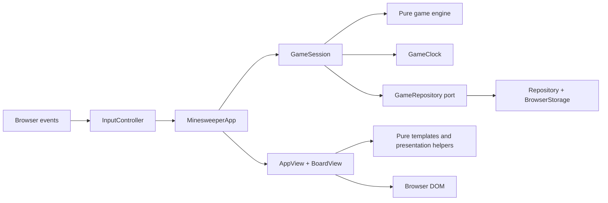

# Reading the code: an OOP shell around a functional core

All game behavior is written in TypeScript. The `.mjs` files under `scripts/` are development, build, and measurement tools. The application uses objects for state ownership and resource lifetimes, and pure functions for rules, derived values, and HTML generation.

## Responsibilities



| Module                            | Ownership and boundary                                                                                                                                        |
| --------------------------------- | ------------------------------------------------------------------------------------------------------------------------------------------------------------- |
| `src/main.ts`                     | Composition only: find the mount point, create browser adapters, restore preferences, and construct the application.                                          |
| `src/game/engine.ts`              | Immutable `Game` values and pure transitions. Placement, reveal targets, flood fill, win detection, and snapshot validation are separate functions.           |
| `src/application/game-session.ts` | The current game and difficulty, pause/dialog lifecycle, persistence ordering, and result creation. It calls the engine rather than implementing board rules. |
| `src/application/game-clock.ts`   | Accumulated time and active intervals. Its injected monotonic clock makes pause/resume behavior testable without sleeping.                                    |
| `src/storage.ts`                  | A `GameRepository` interface and its string-storage implementation. Parsing, validation, score ordering, migration, and storage failures stay here.           |
| `src/platform/browser.ts`         | Browser time, randomness, identifiers, dates, and deferred access to `localStorage`.                                                                          |
| `src/ui/minesweeper-app.ts`       | Application commands and presentation coordination. It chooses which dialog to show and when to redraw.                                                       |
| `src/ui/input-controller.ts`      | Delegated input listeners, keyboard routing, long-press recognition, and gesture cancellation. An `AbortController` owns listener teardown.                   |
| `src/ui/app-view.ts`              | The application DOM and native dialog presentation. It receives a session snapshot instead of changing business state.                                        |
| `src/ui/board-view.ts`            | Cell elements, visible-cell rendering, and roving keyboard focus.                                                                                             |
| `src/ui/templates.ts`             | Pure HTML-producing functions, including small helpers for tabs, help steps, records, and player-name forms.                                                  |
| `src/ui/presentation.ts`          | Pure time formatting, escaping, cell descriptions, status labels, and keyboard geometry.                                                                      |

## A reveal, from input to saved state

1. `InputController` converts a mouse, touch, or keyboard action into a cell command.
2. `MinesweeperApp` asks `GameSession` to apply that command.
3. `GameSession` rejects paused/dialog-blocked actions and calls `act(game, action)`.
4. The engine returns a new game value. A rejected action returns the original reference.
5. The session starts or stops its clock, records a preset win exactly once, and saves progress in that order.
6. The app passes the resulting state to the view. A completed game opens a result dialog.

The engine receives its seed as data. It never reads browser randomness, clocks, the DOM, or storage. Local mutation inside a shuffle or flood-fill queue does not escape the function; previously returned game values remain unchanged.

## Lifecycle rules

- Flags before the first reveal do not generate the board or start time.
- Restored games begin paused so loading a page cannot add time before the player resumes.
- A dialog resumes a game only if that dialog introduced the pause. It does not override a user pause.
- Leaving the page cancels automatic dialog resume, including when the dialog had already paused the board.
- Difficulty changes save the old game before loading the selected slot. Invalid custom dimensions are rejected before replacing state.
- Restarting clears the previous result, clock interval, dialog ownership, focus, and pending long press.
- Disposing the application stops the timer, aborts event listeners, cancels gestures, and checkpoints progress. Vite's disposal hook uses the same path.

These rules are tested through real `GameSession`, `GameClock`, and `Repository` objects with deterministic time and in-memory storage. The same behavioral tests are compiled and run with both TypeScript 6 and TypeScript 7 in the A/B workflow.

## Code style

Named functions, methods, lifecycle callbacks, and boundary operations have documentation comments explaining their purpose or contract. Internal comments explain decisions such as unbiased sampling, safe first-click generation, pause ownership, hidden-clue protection, and storage validation. Small inline collection callbacks inherit the surrounding function's explanation.

Use blank lines to separate validation, state calculation, side effects, and return values. Prefer explicit blocks to several statements on one line. Keep template fragments in named helpers when nested interpolation becomes difficult to read.

The project pins Prettier and checks formatting in `npm run check` and CI:

```sh
npm run format
npm run format:check
```

Formatting is automatic; meaningful boundaries and comments remain an implementation responsibility.
