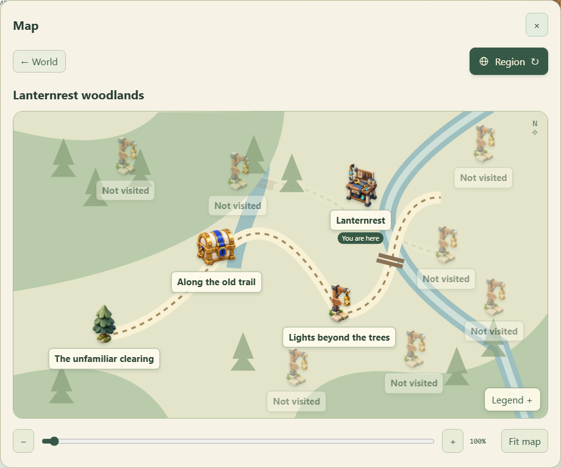
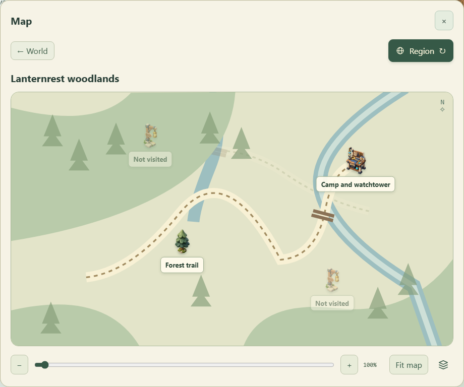

# Atlas detail and business-code boundaries

The atlas now renders its world and region charts as visible vector tiles. At a distant scale it shows regions or districts; zooming in replaces these with individual locations. A location opens its local map through the existing discovery gate. This is map navigation only: it cannot move the traveler, grant a task, unlock an entrance or modify either attempt.

The same early-camp checkpoint at 100% regional zoom, before and after this change:

| Previous map                                                                    | Regional overview                                                             |
| ------------------------------------------------------------------------------- | ----------------------------------------------------------------------------- |
|  |  |

## Geographic data and presentation

- `game/atlas-catalog.ts` owns named places, district membership, artwork choices and the region's world placement. A new catalog entry does not renumber unrelated geographic connections.
- `game/atlas-connections.ts` resolves named local-map connections and shares northwest portal requirements with physical travel. `game/story-task-location.ts` resolves task locations from permanent outcomes.
- `ui/atlas-camera.ts` contains pure camera clamping, anchored zoom, semantic detail selection and visible quadtree address calculations. The world supports 1–8× zoom and the region/local maps 1–4×.
- `ui/atlas-terrain.ts` owns the existing original vector artwork. Tiles select source rectangles from it, preserving sharp edges at every level; no third-party tile service, network API or new bitmap generation is involved.
- `ui/atlas-tiles.ts` retains intersecting tile elements and removes addresses outside the viewport. It switches accessible marker layers with the same zoom state. Hidden layers are inert and cannot receive keyboard focus.
- `ui/atlas-chart.ts` renders named geographic markers; `ui/atlas-local.ts` renders local boards; `ui/story-map.ts` composes the map shell. Neither camera input nor templates own campaign progress.

The transparent, icon-only legend control lives in the zoom bar outside the drawing. Its accessible name, expanded state and localized legend remain available. Labels and destination icons retain a readable screen size while geography zooms. Each map remembers its camera during the current UI session, including when returning from a submap.

Mouse wheel, range controls, zoom buttons, keyboard navigation, dragging and two-finger pinch all use the same camera math. A gesture is explicitly idle, panning, pinching or waiting for remaining fingers to lift. Finishing a pinch cannot activate a location underneath it. Outer-map destinations use one click or tap; local landmark descriptions retain their inspect-and-open interaction.

## Shared presentation ownership

`SceneTransition` owns one cancelable incoming-scene animation. The router, atlas and physical story travel each hold their own instance of this shared owner. Replacing a view cancels its outgoing effect; disposal and language changes release it; reduced-motion preference skips it. Gameplay remains committed before visual travel or arrival effects run.

`story-assets.ts` owns camp-facility artwork shared by the live scene and its map. Existing rail, power and dungeon sprite helpers continue to own their corresponding assets. Sharing imagery does not require importing an entire page template into another renderer.

Task details now compose the same description fragment into compact and expanded containers. They no longer locate and cut HTML strings to reuse a subsection.

## Repository-wide review and maintenance

The review traversed the TypeScript source tree for named behavior documentation, declaration placement, dependency direction and dense procedural blocks. Missing purpose comments were completed and validation, calculation, effects and return phases were separated. Existing functional rules and object-owned sessions remain the architecture; no parallel game engine or compatibility implementation was added.

`check:contracts` now also rejects undocumented named functions, methods and lifecycle callbacks, game-layer imports of outer adapters, and application imports of UI modules. Short anonymous collection callbacks inherit their containing function's explanation. Explicit module-scoped `.d.ts` contracts and the existing restrictions on wide/dynamic types remain enforced.

`check:i18n` detects duplicate catalog keys and recursively inspects nested UI modules in addition to checking three-language key parity, interpolation names and localized UI calls. Formatting, types, both behavior suites and Pages declaration verification remain separate gates. These automated checks support code review; they do not prove that every future design is sound.

## Subsequent chapter direction

Each chapter can have its own explorable regional camp with local residents, story tasks, artwork and changes caused by the player's actions. Supplies, ownership, professions, loadouts, ordinary tasks, achievements and Recollection belong to the shared party progression. Existing camps remain available for unfinished side stories.

The formal Recollection facility is planned for the beginning of Chapter Two, initially drawing on experienced Chapter One mechanics and bosses. It remains optional, and later campaign discoveries expand its selectable pools. The temporary roguelite entrance remains until the integrated facility is ready. This atlas change does not claim to implement Chapter Two or additional camps.

## Verification

Camera tests cover anchored zoom, edge bounds, tile coverage across viewport sizes, catalog completeness, discovery gates and task destinations. Browser checks cover narrow and 4K layouts, three languages, native touch pinch with delayed release, direct location activation, camera restoration, transparent controls, keyboard use and unchanged serialized saves. Chapter-finale checks exercise the discovered northwest maps and physical route independently.
