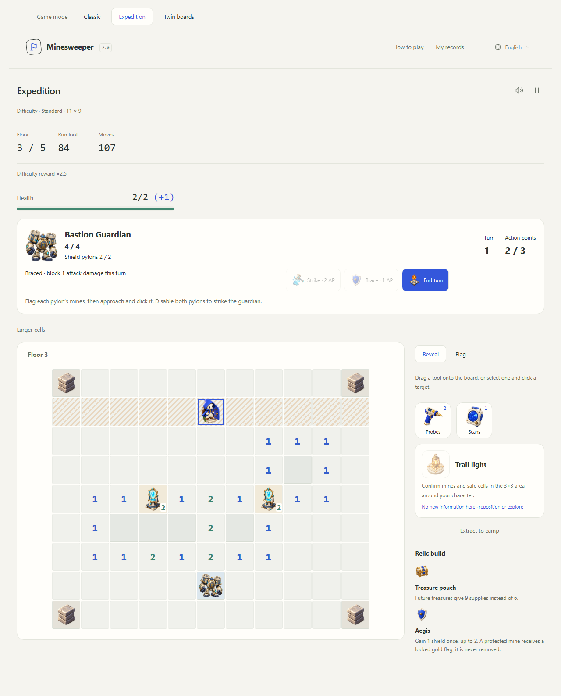
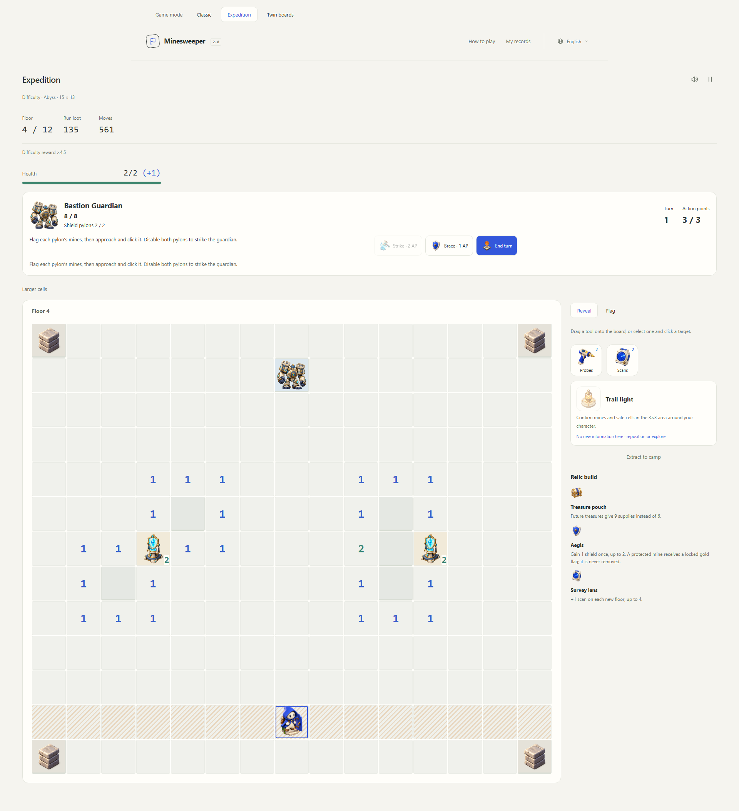

# Bastion Guardian: tactical encounter rules

This document records the historical first encounter revision. The implementation below has been removed. Current play uses the [tactical encounters and build rules](tactical-builds.md); incompatible saved expeditions [return to camp](save-policy.md).

The first encounter in [Roadmap #1](https://github.com/shipiyouniao/Minesweeper-2.0/issues/1) adds a separate turn-based room to Expedition. Ordinary floors retain free exploration. There are no real-time attacks or countdowns.

## Flow and difficulty

Walk to the ordinary stairs on a guarded floor to enter the arena. The exit payment and relic choice wait until the guardian is defeated. Tools, health, shields, relics, spent floor skills and claimed reactions carry into combat. Players can still extract to camp with secured loot.

| Difficulty | Guarded floors | Arena   | Guardian HP |
| ---------- | -------------- | ------- | ----------: |
| Relaxed    | 3              | 11 × 9  |           4 |
| Standard   | 3, 5           | 11 × 9  |           4 |
| Advanced   | 3, 7           | 13 × 11 |           6 |
| Expert     | 3, 6, 9        | 13 × 11 |           6 |
| Abyss      | 4, 8, 12       | 15 × 13 |           8 |

Historical `bastion-v1` departures use the guardian at every checkpoint. New `brood-v1` departures alternate it with the [Brood Queen](brood-queen.md), starting from a seeded choice. The other three planned bosses remain unimplemented.

## Mine deduction and armor

Two pylons each have exactly two mines in their surrounding eight cells. The mines are selected by seeded shuffle from the ring corners. Outer clues make every mine deducible without guessing, equipment or a purchased profession. Revealed zeros expand fully. The safe arena, approach lanes and mechanisms belong to one connected orthogonal component; the boss itself is impassable.

Ring cells are excluded from direct opening seeds, not protected by a permanent reveal mask. A safe ring cell next to a revealed zero opens normally, preserving the same blank-expansion rule as ordinary floors. All four mines remain covered on entry. Tests verify both properties together across the tier/seed matrix.

Flag the two mines, move orthogonally adjacent to a pylon and click it to calibrate. The public prerequisite checks adjacency, flag count and action points. Correct flags disable that pylon permanently, lock its mines as gold flags and survey its safe neighbors. A committed incorrect calibration costs its action point and deals one feedback damage; it is not a free hidden-mine query. Both pylons must be disabled before the guardian can be struck.

## Turn budget and attack forecasts

| Action                                 |                                 Cost |
| -------------------------------------- | -----------------------------------: |
| Move through revealed safe cells       |                        1 AP per step |
| Approach and reveal                    |                 Path distance + 1 AP |
| Calibrate a pylon                      |                                 1 AP |
| Probe, row scanner or profession skill | 1 AP plus its ordinary resource cost |
| Brace                                  |                 1 AP, once this turn |
| Adjacent strike                        |                 2 AP, deals 2 damage |
| Place/remove an ordinary flag          |                                 Free |
| End turn / extract                     |                                 Free |

Each turn starts with three AP. Pointer hover and keyboard focus preview the known route and cost; unaffordable routes are dashed and cannot animate or mutate state. Rejected actions consume nothing. Running out of AP never ends a turn automatically.

The guardian announces one frozen footprint at a time: the pawn's row, then its column, then a cross through the guardian, repeating. The row/column is captured when the intent is announced and does not follow later movement. Striped tiles and accessible labels show the danger. **End turn** resolves one damage on the announced cells, then announces the next intent and refills AP. Brace blocks one attack damage for the current turn, without adding a persistent shield or blocking calibration feedback. A cautious player can reserve AP for brace; taking a shorter route or dodging lets the remaining AP go toward the puzzle.

## Resources and rewards

Shields absorb damage before HP. Second wind can save one lethal hit, including a boss attack or calibration mistake. Rescue ribbon also reacts to surviving HP damage; Reactive shell remains specific to shielded mine hits. Entering the arena does not refresh a spent skill or once-per-floor relic. Archaeologist targets the nearest active pylon during combat, revealing its safe clues and marking mines; other profession skills keep their ordinary behavior.

Victory restores full HP and grants one shield, capped at two. It then grants the existing 12-supply floor exit payment and proceeds to relic selection or final victory. There are no extra chests or currency rewards in the arena. The difficulty reward multipliers, pricing table and maximum currency calculations are unchanged. Banking remains one atomic operation; reload cannot duplicate rewards.

## Architecture and recovery

- `bastion-arena.ts` owns the authored tier table and deterministic terrain.
- `tactical-intents.ts` produces immutable public forecasts.
- `tactical-planning.ts` calculates public action eligibility and route costs before animation.
- `tactical-encounter.ts` resolves combat and delegates ordinary tools/movement through a typed transition port.
- `expedition.ts` owns room entry, floor rewards and between-floor resource handoff.
- The session journals accepted intents. UI adapters render the same snapshots and do not own combat state.

Contracts live in module-scoped `.d.ts` files with explicit action and state unions. New departures record `encounters: 'bastion-v1'` alongside the skill and relic revisions. Old departures without that marker retain their original stairs and replay. Recovery validates the marker, allows coordinates for both the selected ordinary board and arena, then replays against each actual room. Hidden mine layouts, AP, HP and rewards are never trusted from serialized snapshots.

## Validation and artwork

Domain tests check exact mine counts, truthful clues, zero expansion, safe connectivity, public-clue deductions across 160 tier/seed combinations, and zero-tool victories across 40 combinations. They also cover costs, frozen forecasts, damage/revival, incorrect calibration, locked flags, profession behavior and replay. The full all-tier session test now crosses every configured boss and still verifies exhausted relic pools and exactly-once settlement.

Browser acceptance covers all five tiers in English, Chinese and Japanese, keyboard actions, pointer routes, tool targeting precedence, refresh during combat, a complete played battle and 320px fitting without horizontal overflow. The nine [generated assets](bastion-artwork.md) include the guardian, defeated state, core, two pylon states, strike, intent, workshop and archive. Original PNG alpha is preserved and build verification checks each copy.

Active Expedition and Twin layouts adapt to browser width. The later [compact wide-screen adjustment](brood-queen.md#more-compact-wide-screen-play) caps cells at 88px and the full play container at 2880px, with proportional sidebar controls. Narrow screens still fit and offer explicit enlargement. Skill images remain centered. The screenshot below records the original guardian release layout.

