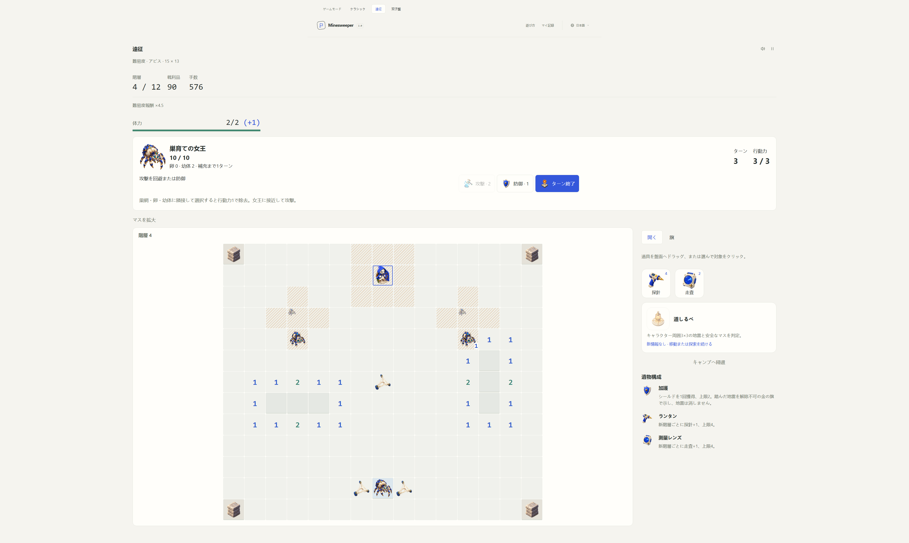
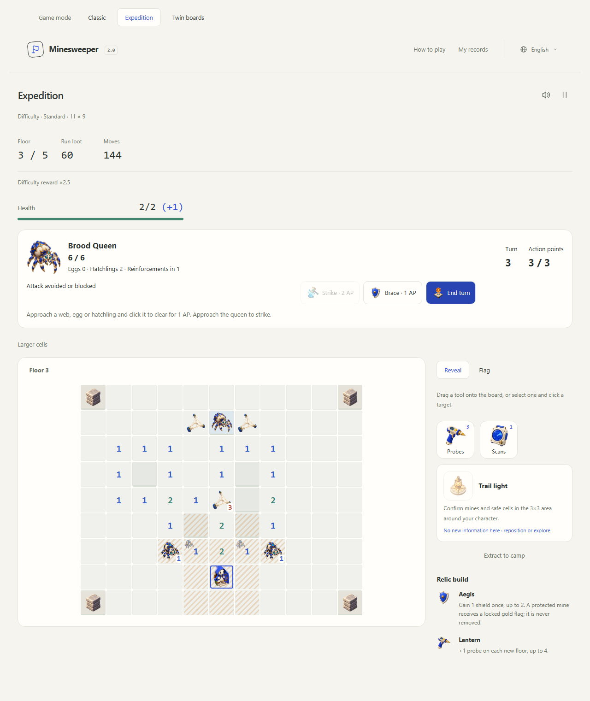
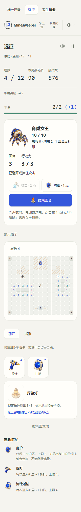

# Brood Queen: routes, eggs and interception

This document records the historical first encounter revision. New departures use the [revised tactical encounters and build rules](tactical-builds.md); saved older expeditions retain the behavior below.

The second encounter in [Roadmap #1](https://github.com/shipiyouniao/Minesweeper-2.0/issues/1) is a route-management battle. The queen has no shield pylons. Players can strike her immediately from an adjacent square, but removable webs and advancing hatchlings compete for movement and action points. Ordinary floors remain untimed exploration.

## Encounter selection and difficulty

New departures capture `encounters: 'brood-v1'`. The first boss is selected by seed parity, then subsequent checkpoints alternate between Bastion Guardian and Brood Queen. Both bosses can therefore appear on Relaxed's single checkpoint, and longer runs offer both mechanics. Selection consumes no extra random draws and is reproduced from the departure and checkpoint ordinal.

| Difficulty | Guarded floors | Arena   | Queen HP |
| ---------- | -------------- | ------- | -------: |
| Relaxed    | 3              | 11 × 9  |        6 |
| Standard   | 3, 5           | 11 × 9  |        6 |
| Advanced   | 3, 7           | 13 × 11 |        8 |
| Expert     | 3, 6, 9        | 13 × 11 |        8 |
| Abyss      | 4, 8, 12       | 15 × 13 |       10 |

Historical `bastion-v1` departures retain guardian-only checkpoints. Departures without an encounter revision retain their original exits. Buying content or updating the application cannot replace a boss in an ongoing saved run.

## Public rules

| Action or entity           | Rule                                                                                                              |
| -------------------------- | ----------------------------------------------------------------------------------------------------------------- |
| Player turn                | Three AP. No real-time timer and no automatic end-turn at zero AP.                                                |
| Walk / reveal              | One AP per step along a revealed safe route; revealing costs one additional AP.                                   |
| Queen strike               | Two AP, two base damage from an orthogonally adjacent square. Applicable relics can enhance it.                   |
| Web                        | Blocks walking. Clear from an adjacent square for one AP, permanently for this room, or use a detour.             |
| Egg                        | Blocks walking and shows a two-turn hatch countdown. Clear adjacent for one AP to prevent that egg from hatching. |
| Hatchling                  | Clear adjacent for one AP. Otherwise it commits to one safe step per turn and a visible attack footprint.         |
| Tools and career skill     | One AP plus the existing tool cost or floor skill charge.                                                         |
| Brace                      | One AP, once per turn; blocks the turn's one point of combined swarm damage.                                      |
| Flags / End turn / extract | No AP cost. Extract retains the normal secured-loot rules.                                                        |

The initial room contains three webs and two eggs. Every third end-turn checks the two nest sites for replacement eggs. A site occupied by the player, an egg or a hatchling cannot receive another egg. Eggs and hatchlings together are capped at three; the system does not bank skipped reinforcements. Existing webs do not regrow.

Egg counters decrease only on explicit end-turn. Hatching happens after the current attack has resolved, so newborns never attack on the turn they hatch. The interface shows egg countdowns, the next reinforcement check and the number of active hatchlings.

## Forecasts and resolution

At the beginning of each turn, hatchlings find a shortest approach through publicly revealed safe cells. Mines, permanent walls, webs, eggs and other hatchlings remain blocked; reserved destinations prevent overlap. They stop adjacent to the player. Their next position is displayed as a small ghost sprite. An attack covers that position and its four orthogonal neighbors.

Every third turn the queen additionally announces a silk burst over the player's current 3×3 neighborhood. That footprint stays fixed when the player moves. It deals attack damage, not a new persistent web or a change to the mine layout. Stripes show the union of all current attack footprints. Clearing a hatchling cancels only that source's warning; the queen's warning and surviving orders stay frozen.

End-turn resolves the announced damage, survival reactions, surviving hatchling movement, egg countdowns/hatching and bounded reinforcement, in that order. Then it grants the next turn's AP and announces the new footprint. If the player moved into an announced destination, the warned hit still applies but the hatchling stays at its original position instead of overlapping or displacing the pawn. Lethal damage ends the run before creature or reinforcement progression.

Overlapping attacks deal **one combined damage**, not one damage per source. This deliberate starting balance makes Brace a reliable fallback for the free profession; dodging, interception and destroying eggs free AP for movement or attacks. There is no hidden enrage timer or mandatory purchased counter.

## Terrain, builds and rewards

The room has four shuffled corner mines in two clue pockets. Their numbers remain truthful, zeros propagate normally, and the permanent safe floor is one connected orthogonal component. Webs and creatures occupy revealed safe cells separately from terrain. Clearing them changes no mine, number, flag or revealed cell. Multiple approach lanes remain available.

Tools, health, shields, relics, spent skills and once-per-floor claims carry across room entry. Archaeologist scouts the nearest nest whose 3×3 neighborhood still contains unknown information. Existing movement, first-strike, shield, survival, spare-AP and turn-three relics apply. Breach sigil remains a guardian-calibration relic; clearing ordinary brood entities cannot trigger its refund. Destroying brood entities grants no currency or discovery count, preventing reinforcement farming.

Victory restores full health, grants one shield up to the cap of two, and grants the existing twelve-supply floor exit payment. It then opens relic selection or ends the final floor. Reward multipliers, maximum currency formulas, the seventeen camp purchases and existing prices are unchanged. Run settlement remains atomic.

## Architecture and acceptance

`TacticalEncounter` is an explicit union of `BastionEncounter` and `BroodEncounter`, with common turn fields in `TacticalState`. Contracts are authored in `.d.ts` files. Each boss owns meaningful state: armor controls for the guardian; webs, eggs, hatchlings and frozen source orders for the queen.

- `encounter-roster.ts` owns versioned selection, and `encounter-tiers.ts` owns the checkpoint and arena table.
- `arena-terrain.ts` shares zero expansion; each boss's arena module owns its layout and entities.
- `dungeon-occupancy.ts` keeps removable entities separate from permanent walls, consistently for movement and frontier reachability.
- `brood-turns.ts` owns public forecasts, interception and turn progression. The common tactical orchestrator retains action costs, damage and expedition integration.
- Presentation modules render the same snapshot, preserving tool-targeting precedence, keyboard focus, sound feedback and the header's help entry.

The session saves accepted intentions rather than mutable arena snapshots. Replay reconstructs creature counts, timers, forecasts, AP, health and rewards. Tests cover 160 tier/seed terrain cases, 40 zero-tool victories, frozen warnings and cancelled sources, countdowns, occupancy collisions, resource/relic interactions, legacy roster preservation and per-action journal recovery through a real queen victory and extraction. Browser acceptance covers all five tiers in three languages, keyboard and pointer controls, two complete played battles, reload, transparent sprites and 320–3840px layouts.

## More compact wide-screen play

The active Expedition and Twin container now caps at 2880px instead of filling an arbitrarily wide browser. Cell growth caps at 88px instead of 112px, while symbol sizes stay proportional. Sidebar scaling caps at 1.5×: at a 3840px viewport the sidebar is 570px, its body copy is 18px and tool buttons are 123px. A flag on an 88px cell remains about 57px. Skill images remain centered and the 320px layout fits without horizontal scrolling. Explicit enlargement remains available on narrow boards.

All five [independent generated sprites and their prompts](brood-artwork.md) are included in the repository and checked in the production build.
