# Dungeon artwork

The original nine assets were generated on September 4, 2026 with the built-in image generation tool, one call per asset, without reference images. The profession variants documented below use the original Explorer as a style reference. Each selected PNG is copied unchanged into `public/assets/dungeon/`; CSS controls display size. Transparency is preserved. These are original project assets under the repository MIT license.

The original assets share cobalt, ivory and brass colors with the existing interface. Profession variants add teal and amber accents for recognition. Key cells retain textual accessible labels; clues and inventory counts are real text. Covered mine positions are never illustrated before defeat.

## Assets and exact prompts

### `player.png`

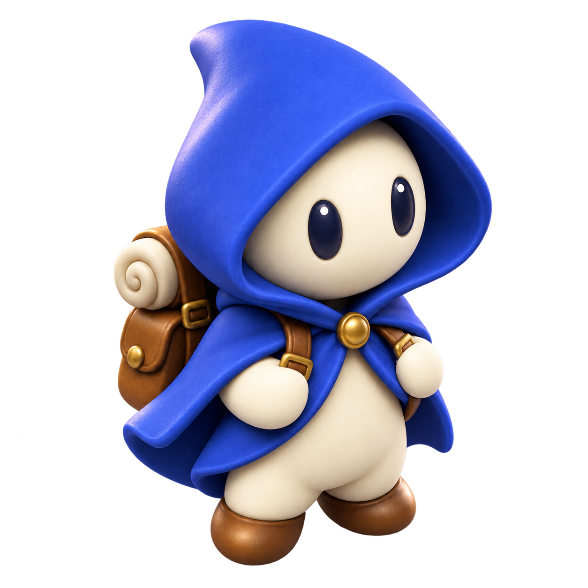

Use case: stylized-concept. Production game sprite for a minimal Minesweeper roguelite. A single charming tiny dungeon explorer pawn, cobalt blue hooded cloak, ivory rounded body, small warm brass backpack, facing three-quarter front. No weapons. Style: beautiful restrained 3D clay/ceramic miniature, orthographic three-quarter view, soft studio lighting from upper left, crisp silhouette readable at 32 pixels, no fine textures. Transparent alpha background, isolated centered single object occupying about 80 percent of a square canvas, no ground plane, very subtle contact shadow only, no surrounding scene, no text, no watermark, no border. Palette matches warm ivory #fffefa and cobalt #3457db. Generate one square PNG game asset.

### `entrance.png`

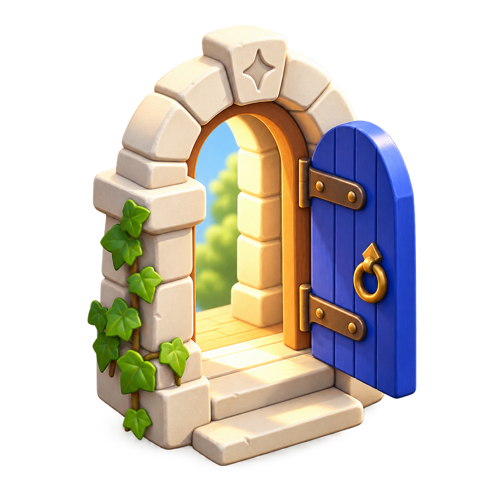

Use case: stylized-concept. Production game sprite for a minimal Minesweeper roguelite. A single small open stone entrance arch with a warm ivory stone frame and a cobalt blue door swung outward, welcoming daylight inside. Style: beautiful restrained 3D clay/ceramic miniature, orthographic three-quarter view, soft studio lighting from upper left, crisp silhouette readable at 32 pixels, no fine textures. Transparent alpha background, isolated centered single object occupying about 80 percent of a square canvas, no ground plane, very subtle contact shadow only, no surrounding scene, no text, no watermark, no border. Palette matches warm ivory #fffefa and cobalt #3457db. Generate one square PNG game asset.

### `exit.png`

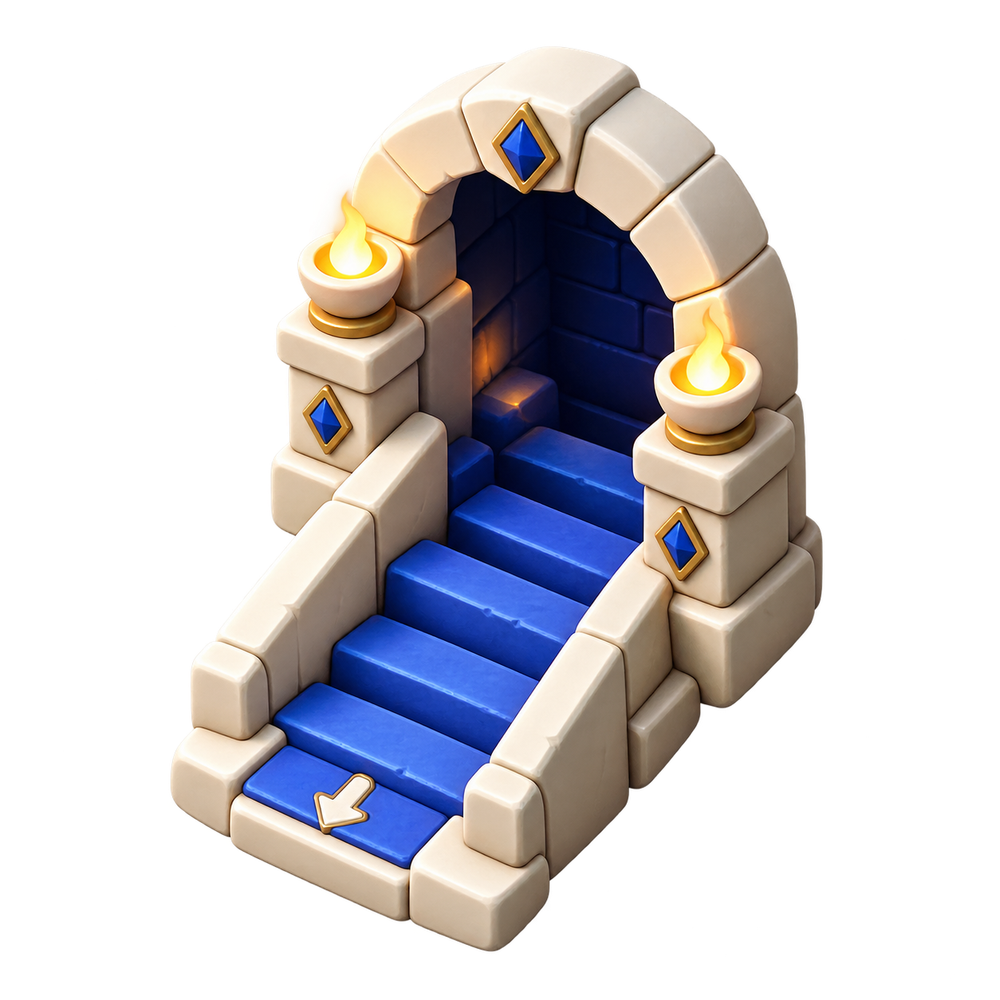

Use case: stylized-concept. Production game sprite for a minimal Minesweeper roguelite. A single compact descending dungeon staircase framed by an ivory stone arch, cobalt blue steps leading down, unmistakable stairs to the next floor. Style: beautiful restrained 3D clay/ceramic miniature, orthographic three-quarter view, soft studio lighting from upper left, crisp silhouette readable at 32 pixels, no fine textures. Transparent alpha background, isolated centered single object occupying about 80 percent of a square canvas, no ground plane, very subtle contact shadow only, no surrounding scene, no text, no watermark, no border. Palette matches warm ivory #fffefa and cobalt #3457db. Generate one square PNG game asset.

### `treasure.png`

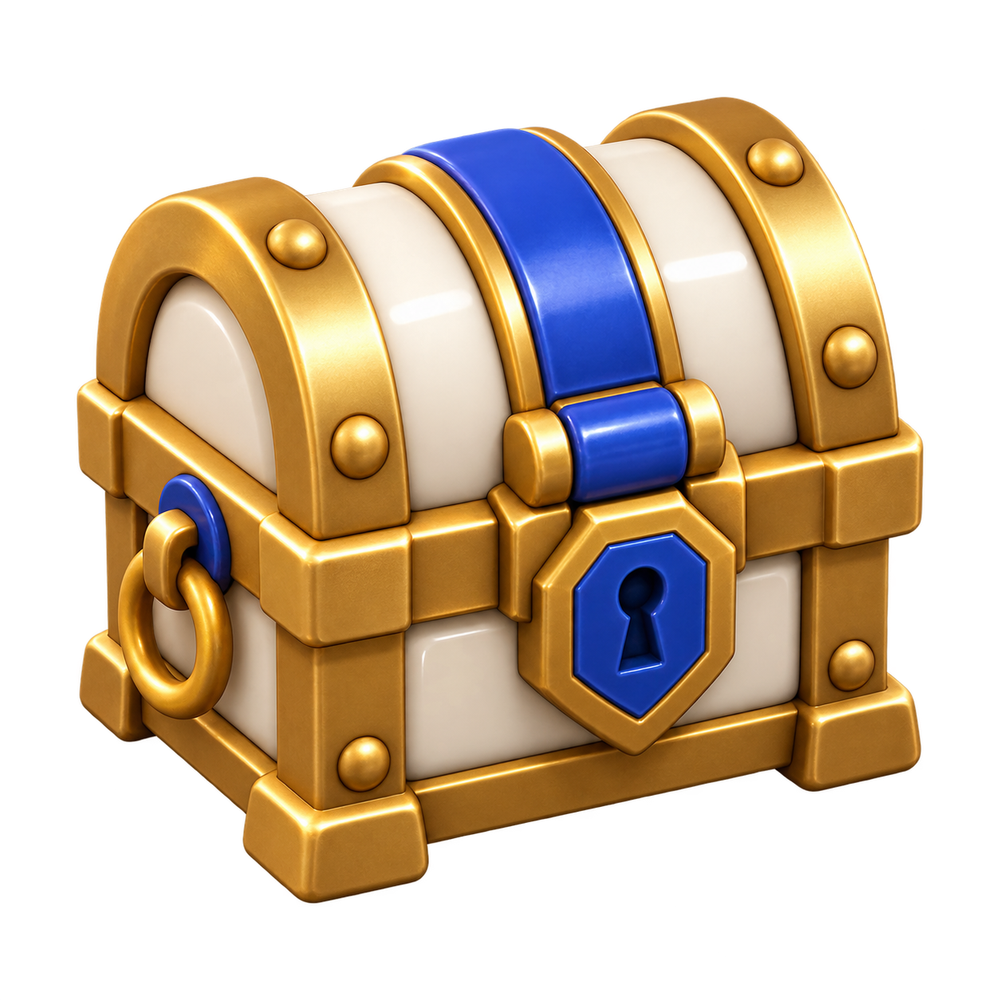

Use case: stylized-concept. Production game sprite for a minimal Minesweeper roguelite. A single closed small treasure chest in warm brass and ivory, cobalt blue latch, simple chunky silhouette. Style: beautiful restrained 3D clay/ceramic miniature, orthographic three-quarter view, soft studio lighting from upper left, crisp silhouette readable at 32 pixels, no fine textures. Transparent alpha background, isolated centered single object occupying about 80 percent of a square canvas, no ground plane, very subtle contact shadow only, no surrounding scene, no text, no watermark, no border. Palette matches warm ivory #fffefa and cobalt #3457db. Generate one square PNG game asset.

### `wall.png`

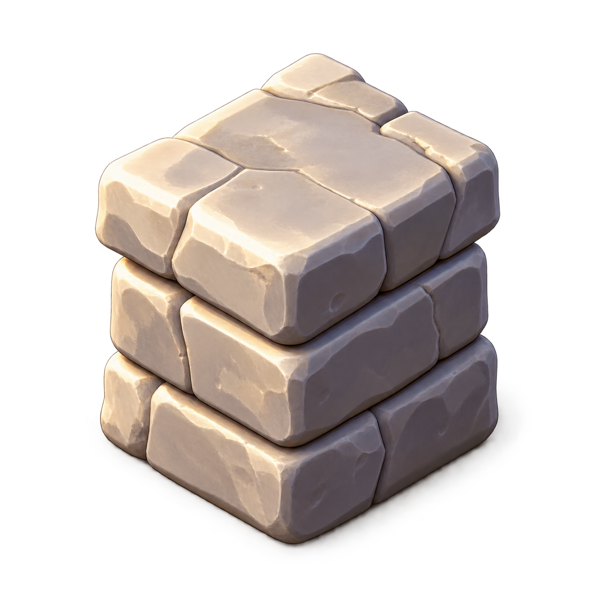

Use case: stylized-concept. Production game sprite for a minimal Minesweeper roguelite. A single square low dungeon wall block built of three chunky warm gray stone bricks, ivory bevels, top surface visible. Fits a square game tile. Style: beautiful restrained 3D clay/ceramic miniature, orthographic three-quarter view, soft studio lighting from upper left, crisp silhouette readable at 32 pixels, no fine textures. Transparent alpha background, isolated centered single object occupying about 80 percent of a square canvas, no ground plane, very subtle contact shadow only, no surrounding scene, no text, no watermark, no border. Palette matches warm ivory #fffefa and cobalt #3457db. Generate one square PNG game asset.

### `probe.png`

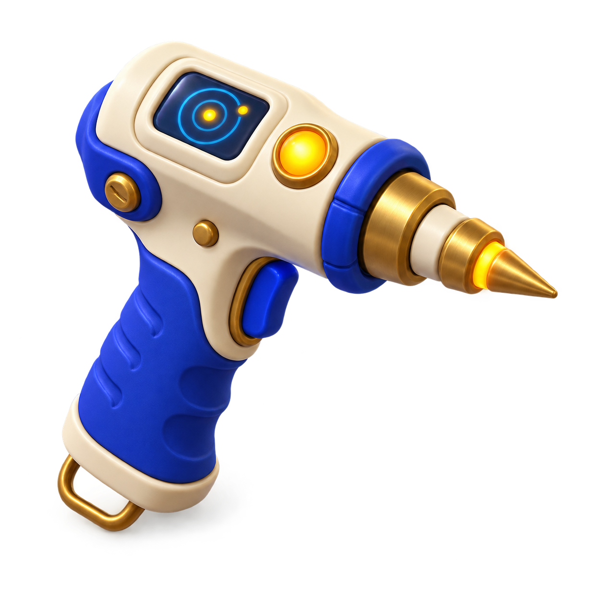

Use case: stylized-concept. Production game sprite for a minimal Minesweeper roguelite. A single handheld exploration probe gadget, cobalt blue grip, ivory body and warm brass pointed sensing tip, a small glowing indicator. Simple tool icon. Style: beautiful restrained 3D clay/ceramic miniature, orthographic three-quarter view, soft studio lighting from upper left, crisp silhouette readable at 32 pixels, no fine textures. Transparent alpha background, isolated centered single object occupying about 80 percent of a square canvas, no ground plane, very subtle contact shadow only, no surrounding scene, no text, no watermark, no border. Palette matches warm ivory #fffefa and cobalt #3457db. Generate one square PNG game asset.

### `scanner.png`

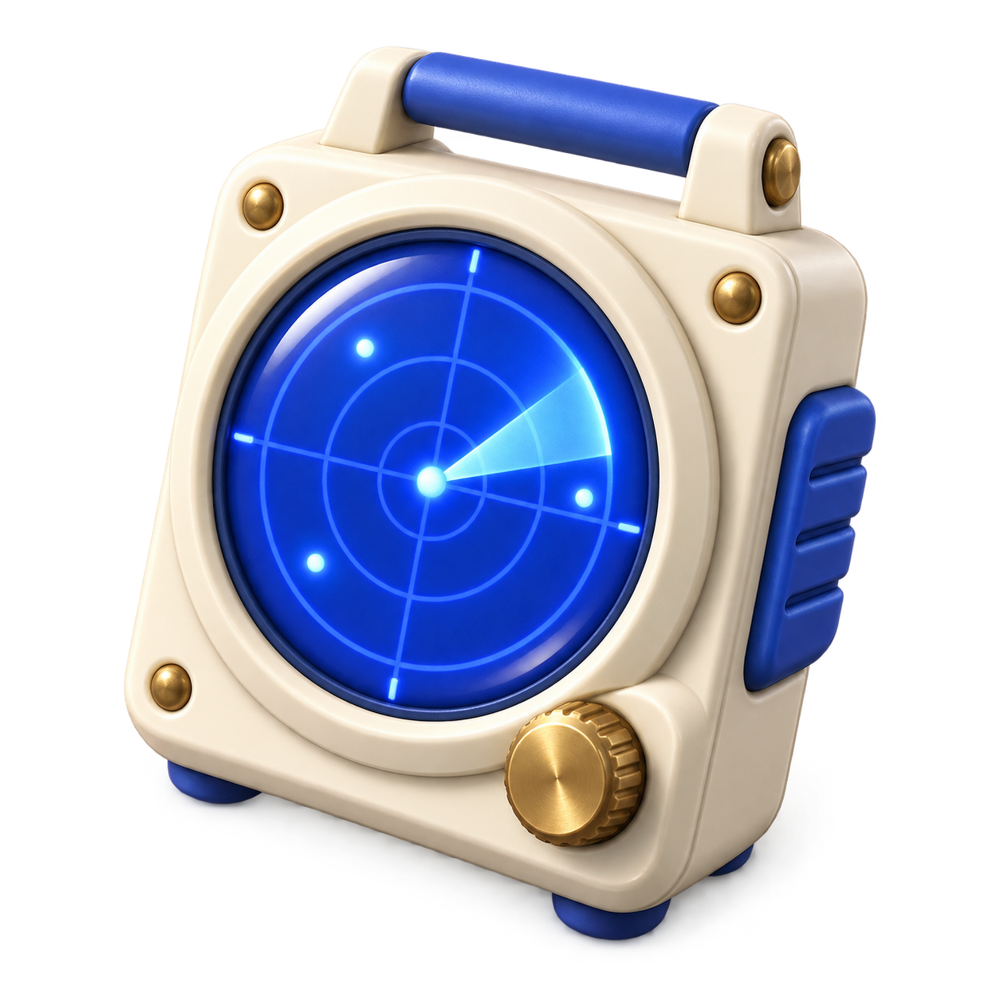

Use case: stylized-concept. Production game sprite for a minimal Minesweeper roguelite. A single handheld row-scanning radar instrument, ivory rounded square case, cobalt blue circular radar screen, one warm brass knob. No letters or numbers. Style: beautiful restrained 3D clay/ceramic miniature, orthographic three-quarter view, soft studio lighting from upper left, crisp silhouette readable at 32 pixels, no fine textures. Transparent alpha background, isolated centered single object occupying about 80 percent of a square canvas, no ground plane, very subtle contact shadow only, no surrounding scene, no text, no watermark, no border. Palette matches warm ivory #fffefa and cobalt #3457db. Generate one square PNG game asset.

### `shield.png`

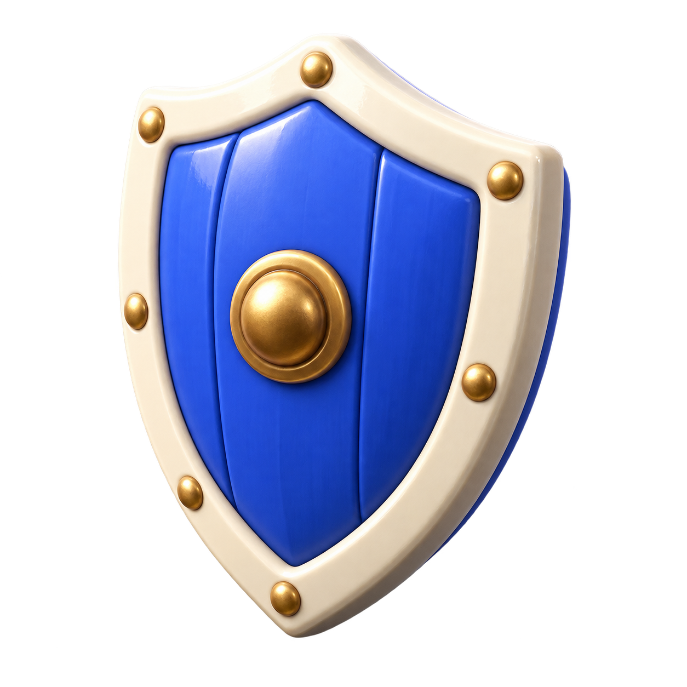

Use case: stylized-concept. Production game sprite for a minimal Minesweeper roguelite. A single thick rounded cobalt blue shield with ivory rim and tiny warm brass central stud, a readable protective equipment icon. Style: beautiful restrained 3D clay/ceramic miniature, orthographic three-quarter view, soft studio lighting from upper left, crisp silhouette readable at 32 pixels, no fine textures. Transparent alpha background, isolated centered single object occupying about 80 percent of a square canvas, no ground plane, very subtle contact shadow only, no surrounding scene, no text, no watermark, no border. Palette matches warm ivory #fffefa and cobalt #3457db. Generate one square PNG game asset.

### `mine.png`

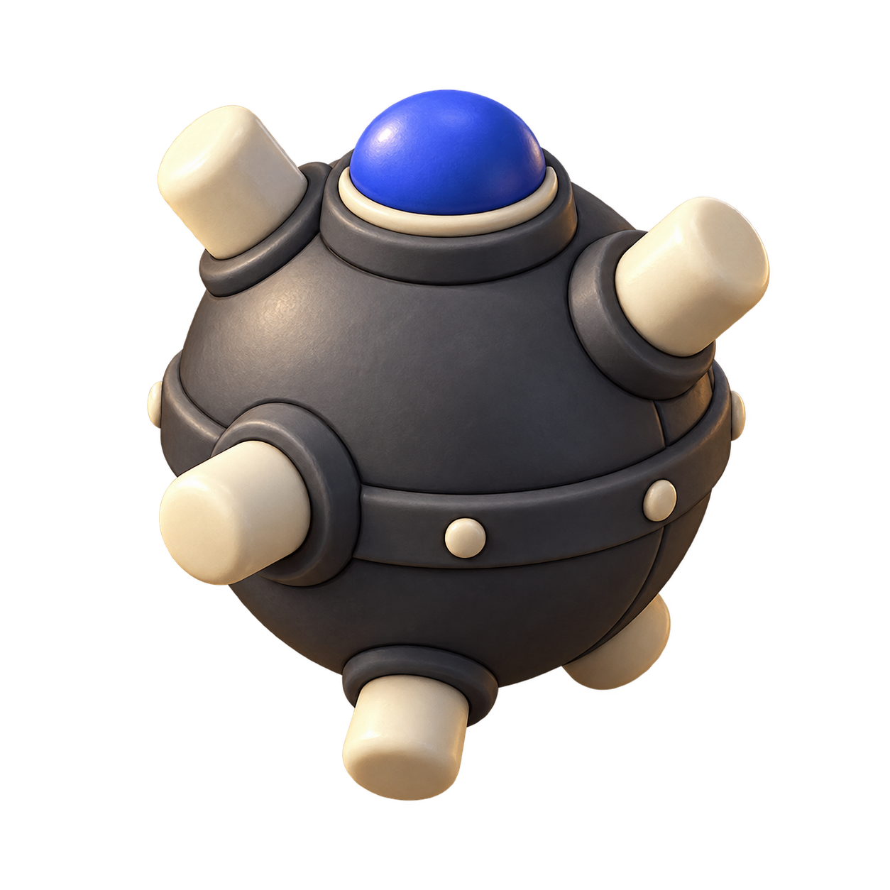

Use case: stylized-concept. Production game sprite for a minimal Minesweeper roguelite. A single stylized round charcoal dungeon mine with five short blunt knobs and one cobalt blue cap, toy-like rather than realistic. Style: beautiful restrained 3D clay/ceramic miniature, orthographic three-quarter view, soft studio lighting from upper left, crisp silhouette readable at 32 pixels, no fine textures. Transparent alpha background, isolated centered single object occupying about 80 percent of a square canvas, no ground plane, very subtle contact shadow only, no surrounding scene, no text, no watermark, no border. Palette matches warm ivory #fffefa and cobalt #3457db. Generate one square PNG game asset.

## Profession variants

The existing `player.png` remains the Explorer. The Surveyor and Engineer were generated on September 4, 2026 with the built-in image tool, using that Explorer as a style reference. Their selected PNGs are copied unchanged into the asset directory. Both contain real transparent alpha. These variants share the original clay style while using distinct silhouettes and equipment; they appear on the profession cards and the walking pawn. Text labels remain the accessible source of each profession's name.

This covers the three currently playable professions. Future professions, skill artwork and Boss assets remain in [Roadmap #1](https://github.com/shipiyouniao/Minesweeper-2.0/issues/1).

### `surveyor.png`

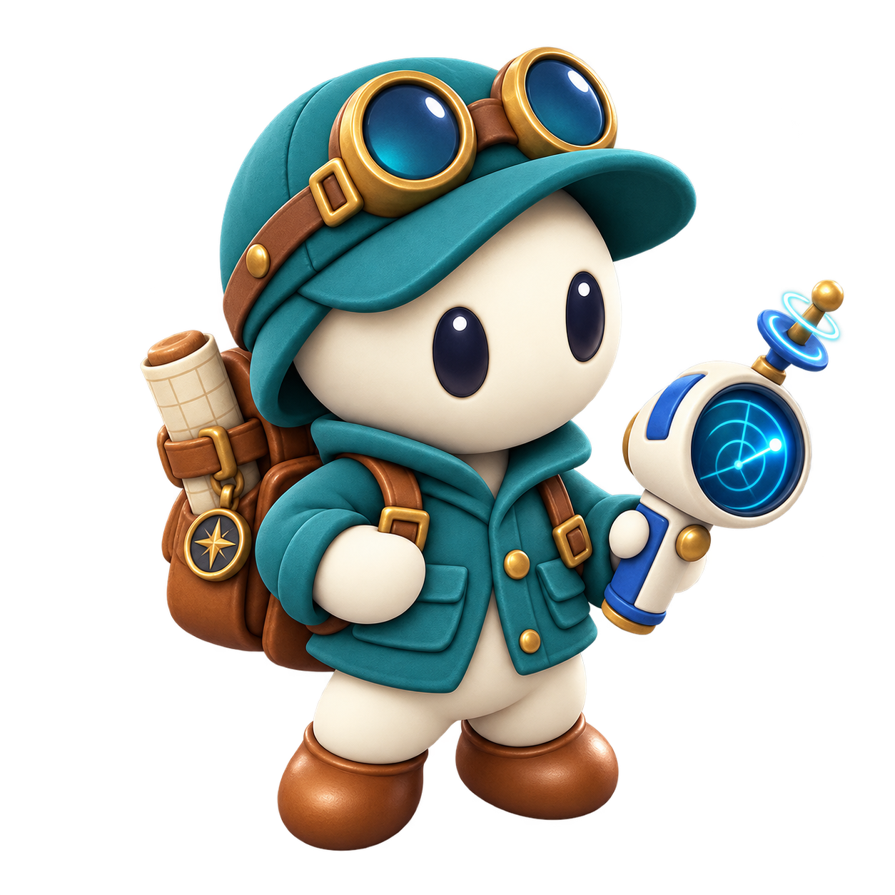

Reference: `public/assets/dungeon/player.png`.

Use case: stylized-concept. Create one production PNG character sprite for the Surveyor profession in a minimal Minesweeper roguelite. Use the reference only for the established beautiful restrained 3D clay/ceramic miniature style, rounded ivory body, large simple dark eyes, proportions, three-quarter front orthographic view and soft upper-left studio light. The Surveyor is a distinct friendly little character wearing a teal survey cap and short teal field jacket, brass goggles resting on the cap, brown boots and a small map backpack, holding one chunky ivory-and-cobalt handheld radar scanner. Give this profession a clear cap-and-scanner silhouette that remains readable at 32 pixels. Use large clean shapes, few details, no writing on the scanner. Center one complete full-body character with every limb visible, occupying about 80 percent of a square canvas with transparent margins. Actual transparent alpha background, isolated subject, no ground plane, no surrounding scene, no words, no watermark, no border. This is a new Surveyor asset; leave the referenced Explorer image unchanged.

### `engineer.png`

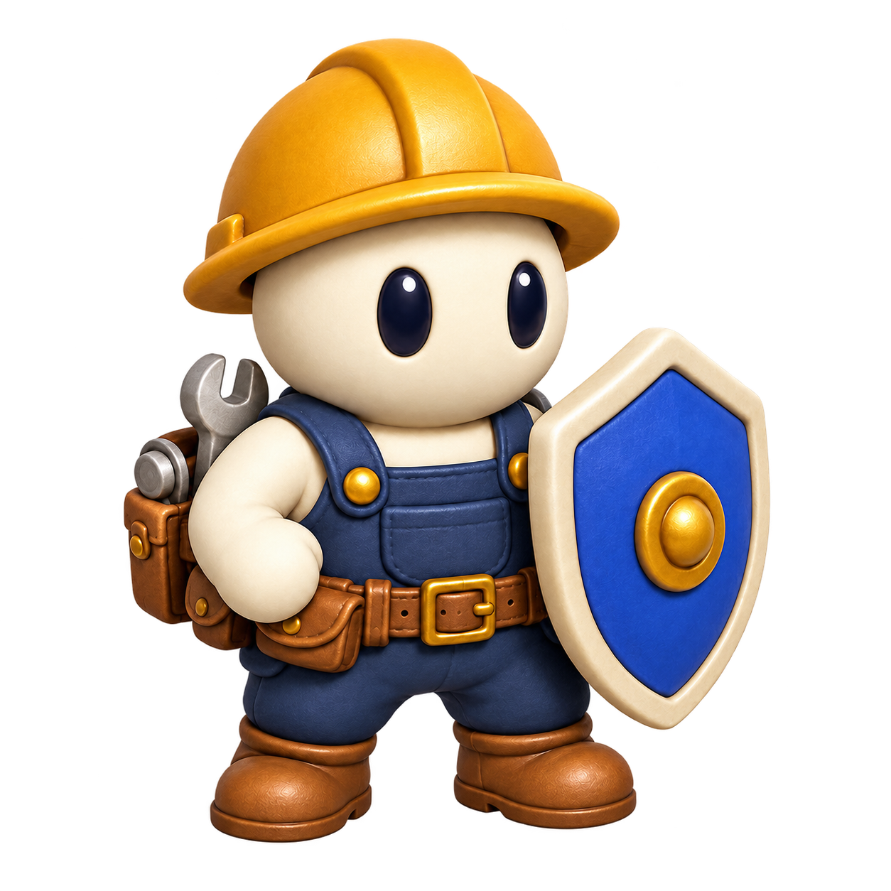

Initial reference: `public/assets/dungeon/player.png`.

Use case: stylized-concept. Create one production PNG character sprite for the Engineer profession in a minimal Minesweeper roguelite. Use the reference only for the established beautiful restrained 3D clay/ceramic miniature style, rounded ivory body, large simple dark eyes, proportions, three-quarter front orthographic view and soft upper-left studio light. The Engineer is a distinct friendly little character wearing a warm amber-yellow hard hat, dark navy work overalls, a small brown utility belt and brown boots. The Engineer holds one chunky rounded cobalt-blue protective shield with an ivory rim and brass center stud, and has a small compact tool pack. Give this profession a clear hard-hat-and-shield silhouette that remains readable at 32 pixels. Use large clean shapes, few details, no writing or symbols. Center one complete full-body character with every limb visible, occupying about 80 percent of a square canvas with transparent margins. Actual transparent alpha background, isolated subject, no ground plane, no surrounding scene, no words, no watermark, no border. This is a new Engineer asset; leave the referenced Explorer image unchanged.

The first output had a painted checkerboard instead of transparency. A second image-tool edit used that output as its only reference and the following exact prompt. Only the corrected transparent PNG is shipped.

Use case: background-extraction. Edit this Engineer game sprite by removing the entire gray-and-white checkerboard background. Preserve the existing character exactly: amber hard hat, ivory face, navy overalls, blue shield, brown boots, pose, colors and full body. Deliver an isolated character PNG with REAL transparent alpha outside the character, including clear gaps around the shield and tools. The checkerboard is accidentally painted into the input and must be removed, not reproduced as a transparency visualization. Do not add a background, floor, border, text or shadow plane. Keep the same square framing and all character details.
