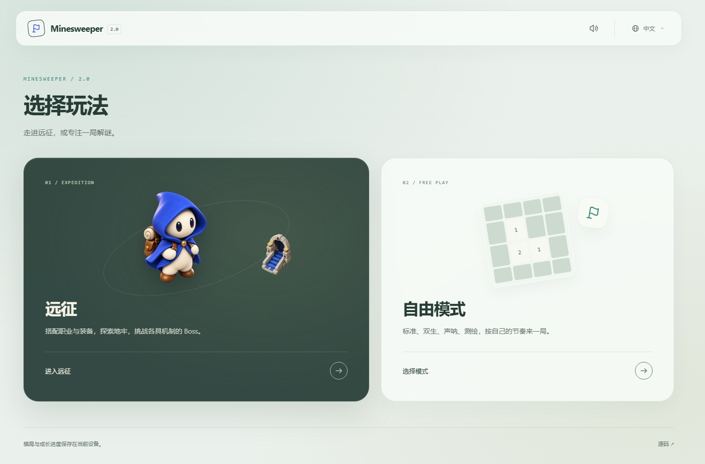

# Home, navigation and glass surfaces

The homepage separates **Expedition** from **Free play**. Expedition opens the existing camp or restores its saved run. Free play opens a directory for Classic, Twin boards, Sonar and Survey, each with a short rule description and a dedicated link. Mode switching is no longer a row of buttons above every game.

[Previous landing screen](screenshots/home-before.png) · [Free play directory](screenshots/free-directory.png) · [Camp on mobile](screenshots/glass-camp-mobile.png)

## Navigation and saved games

| URL                                             | Destination                      |
| ----------------------------------------------- | -------------------------------- |
| `?lang=en` or no query                          | Homepage                         |
| `?page=free&lang=en`                            | Free play directory              |
| `?ruleset=expedition&lang=en`                   | Expedition camp or saved run     |
| `?ruleset=classic`, `twin`, `sonar` or `survey` | Corresponding game               |
| `?mode=expert`                                  | Existing Classic difficulty link |

The logo returns home. Free-mode games have a Free play return link; Expedition has a Home return link. These are real links, so opening a destination in another tab still works. Ordinary activation uses browser history without reloading the document. Back and Forward dispose the outgoing screen and restore the destination normally. Classic remembers the difficulty selected by a direct link, so directory re-entry restores the same save slot. The current language travels with menu links, and language and sound remain shared preferences.

`navigation.ts` contains pure parsing/link helpers backed by explicit `navigation.d.ts` unions. `GameRouter` owns one mounted screen. Before leaving a game, its existing disposal routine checkpoints its save, cancels movement and animations, and releases listeners and audio. `HomeApp` owns menu controls without creating a session or advancing a timer. Classic's restored running games retain their existing paused-until-resumed behavior. Query-only links keep the GitHub Pages base path intact. Save formats and game replay rules do not change.

## Title selection

Titles are selected at camp only. During a floor, the sidebar displays the title captured at departure and its effect, without a selector or next-departure setting. `ExpeditionSession.equipTitle` also rejects changes while any run exists. After settlement and return to camp, title selection is available again. This is an application/UI restriction; existing departure snapshots and title effects remain valid.

## Visual direction

The palette uses muted green, soft light surfaces and one dark expedition card, taking cues from the existing boss dialogue. Thin borders, restrained shadows and generous spacing separate content. Existing project-owned character and stairs sprites illustrate Expedition; small HTML/CSS boards distinguish the free modes without new image dependencies.

Glass colors and blur strength are shared tokens. The header, navigation cards, camp surfaces, information panels and dialogs use translucent backgrounds with a static blur. Covered cells, numbers and tactical glyphs retain opaque surfaces and their established colors. Nothing animates continuously on the menu; entry and hover motion respect reduced-motion preferences. Unsupported blur and reduced-transparency preferences use opaque surfaces.

Blur is not applied to the scroll host or Classic's game-card ancestor: `backdrop-filter` would establish a containing block and trap the fixed action dock. The dock has its own translucent surface and stays at the viewport bottom; the host reserves its height so the board can scroll above it.

## Validation

Route tests cover bare/invalid URLs, every direct game link, old Classic difficulty links, locale round trips and Pages-relative resolution. The title regression rejects changes during a run and permits them again at camp.

`tests/browser/home-navigation.mjs` covers keyboard entry, all four free modes, saved annotations across menu navigation and Back/Forward, shared settings, reload, and responsive layouts from 320px to 4K in all three languages. It checks the fixed dock against the viewport rather than a particular CSS implementation. The title browser suite checks camp selection, the read-only in-run effect and the next departure. Standard full validation and the dual-compiler build comparison still apply.

`tests/browser/glass-accessibility.mjs` emulates reduced transparency and motion against the built page. It verifies opaque menus, the fixed dock and the tutorial dialog, then restores the preference to check that glass returns without a reload. Fallback tokens share the defaults' unlayered cascade so component-layer precedence cannot disable them.
