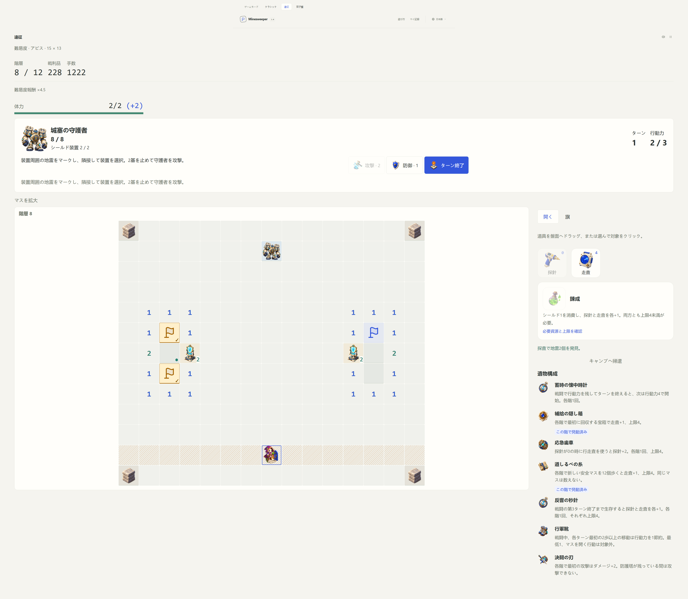
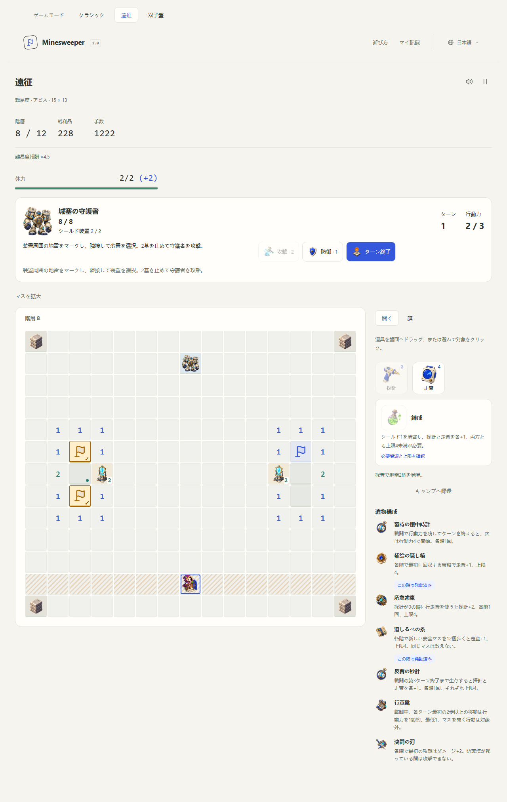
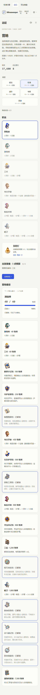

# Journey and tactical relic themes

Six new theme licenses extend the camp from eleven to **seventeen gameplay purchases** and the complete reward pool from fourteen to **twenty-six relics**. They fill the remaining six themes proposed in [Roadmap #1](https://github.com/shipiyouniao/Minesweeper-2.0/issues/1). The seven remaining purchases are equipment licenses and the refit bench; they are not implemented by this batch.

Buying a theme permanently adds two options to future expedition reward offers. It does not grant both relics immediately, increase the number of relics taken per floor, or change a departure already in progress. Theme order is canonical, independent of purchase order. Currency and existing ownership are preserved.

## Price table

| Theme               | Price | Stage  | Main decisions                                         |
| ------------------- | ----: | ------ | ------------------------------------------------------ |
| Cartographer charts |   350 | Middle | Explore new ground and seek useful chest locations     |
| Salvager kit        |   650 | Middle | Recover probes through information gathering           |
| Mechanist gears     | 1,500 | Middle | Coordinate career skills and tool inventories          |
| Wayfarer tokens     | 2,200 | Late   | Spend movement efficiently and avoid announced attacks |
| Duelist marks       | 3,200 | Late   | Exploit successful calibration and the opening strike  |
| Chronologist dials  | 4,500 | Late   | Reserve effort and sustain longer encounters           |

The new themes total **12,400**; the complete seventeen-item catalog costs **26,100**. No effect creates currency, changes chest/exit payments, or changes the difficulty multiplier. The 7,500 archive remains the most expensive single purchase and remains within ten successful Abyss clears even without optional chests. The first two careers still cost 40 and 60. Prices are authored tuning values, not measured playtime promises. See [camp progression](camp-progression.md).

## Effects

| Theme        | Relic           | Trigger and benefit                                                             | Limit                                                      |
| ------------ | --------------- | ------------------------------------------------------------------------------- | ---------------------------------------------------------- |
| Cartographer | Trail thread    | Physically visit twelve new safe squares; gain one scan                         | Once per floor, scan cap four                              |
| Cartographer | Landmark lens   | Collect the first chest; survey that chest's surrounding 3×3 area               | Once per floor                                             |
| Salvager     | Probe recycler  | Spend a probe that gains information but confirms no new mine; refund it        | Once per floor                                             |
| Salvager     | Spare coil      | A row scan confirms at least two new mines; gain one probe                      | Once per floor, probe cap four                             |
| Mechanist    | Skill capacitor | Successfully use a career skill; gain one scan                                  | Once per floor, scan cap four                              |
| Mechanist    | Emergency gears | Spend a row scanner while the pre-use probe inventory is empty; gain two probes | Once per floor, probe cap four                             |
| Wayfarer     | Marching boots  | First walk of at least two steps in a combat turn costs one less AP             | Once per turn, minimum cost one; does not discount reveals |
| Wayfarer     | Shelter cloak   | End a combat turn outside the announced footprint; gain one shield              | Once per floor, shield cap two                             |
| Duelist      | Breach sigil    | First successful pylon calibration returns one AP after its cost                | Once per floor, AP cap four                                |
| Duelist      | Duelist edge    | First strike deals two additional damage, for four total                        | Once per floor; cannot bypass armor                        |
| Chronologist | Reserve watch   | End a combat turn with unused AP; the next turn begins with four                | Once per floor; no accumulating reserves                   |
| Chronologist | Second hand     | Survive the end of combat turn three; gain one probe and one scan               | Once per floor, tool caps four                             |

## Resolution and counterplay

Travel counts unique physically visited squares, not revealed squares, mouse movement or repeated backtracking. The starting square is excluded. Entering a boss room preserves the ordinary room's total and resets only its coordinate set, so two rooms cannot confuse cell indices. A new floor resets the count.

Landmark lens uses the existing shared survey rules: mines become locked gold flags, safe cells are identified, ordinary incorrect flags are cleared, and the original numbers remain truthful. Surveying a chest does not collect any other chest. Clues learned on the approach are retained when the destination is revealed.

Tool effects inspect an accepted intent before processing discovery rewards. Their own refunds do not count as another use. An information-free repeated scan/probe is rejected without spending a charge or a relic use. Emergency gears checks the pre-use inventory, so Spare coil cannot suppress its trigger; both can combine to restore three probes. The existing discovery relics then run once. Resource caps still apply, and capped triggers are consumed rather than banked for later.

Combat previews include Marching boots before checking affordability; a four-step walk can therefore be legal with three AP. A single-step move does not consume the discount. The actual safe route length, including detours, determines eligibility. Reveals retain their ordinary approach-plus-reveal cost. End-turn resets the turn claim; invalid clicks, focus and previews never consume it.

Calibration and attacks pay their AP before rewards. Failed calibration cannot trigger Breach sigil. Attacks remain blocked until both pylons are disabled. Duelist edge is claimed on the first legal strike; displayed damage is the actual health reduction. Reserve watch shows the extra point as `3 / 3 (+1)` and cannot repeatedly accumulate AP. End-turn damage and survival reactions resolve before Shelter cloak or Second hand; neither can resurrect a defeated explorer. All once-per-floor claims survive arena entry.

## Architecture and acceptance

Explicit identifiers live in `relic-packs.d.ts`; travel and turn state live in the expedition and tactical contracts. `exploration-relics.ts` owns travel/tool reactions, `combat-relics.ts` owns public combat costs and combat reactions, and `relic-effects.ts` retains shared claim, damage, chest and discovery rules. The application still journals accepted intentions and rebuilds all counters on restore.

Historical snapshots contain only their captured pack IDs, so appending themes cannot alter their pool or seeded offer order. Tests preserve the original fourteen-entry order, cover all twelve new effects, rejected actions, caps, per-turn/per-floor claims, stacking, lethal damage, real acquired rewards and deterministic replay through a complete boss battle and extraction.

English, Chinese and Japanese descriptions specify each condition and use limit. The six [generated theme icons](journey-relic-artwork.md) are used in camp purchases, reward choices and owned relics. The alchemist portrait now faces right. Wide play layouts scale sidebar text, inventory, skills and combat controls together; flag SVGs, clue numbers, confirmation ticks and safe markers follow their actual cell dimensions rather than fixed tiny pixel caps. Browser acceptance includes 320px fitting and 3840px layout proportions.

The screenshots below record this relic release's initial wide layout. The later [compact layout adjustment](brood-queen.md#more-compact-wide-screen-play) caps the play container at 2880px and cells at 88px. At a 3840px viewport flags are about 57px, sidebar text 18px, inventory buttons 123px and skill controls 96px. Measurements use CSS pixels at browser zoom 100%. The sidebar remains proportional, relic entries keep an icon beside their text, and small viewports fit the board.

