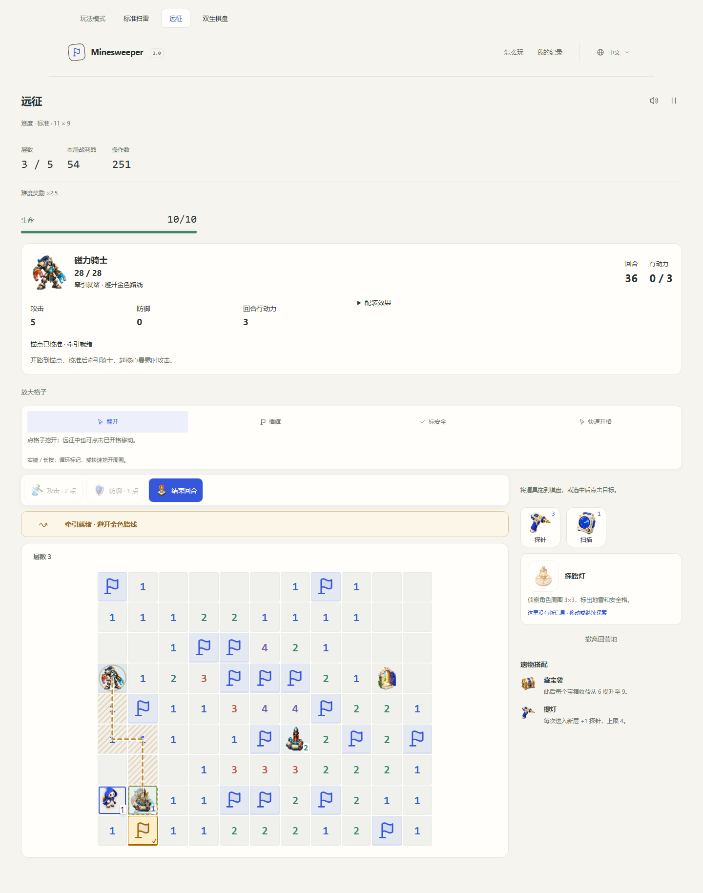
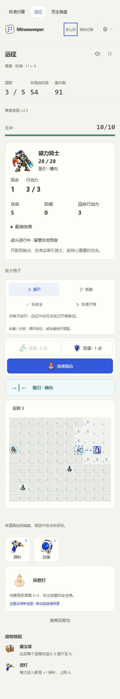

# Magnetic Knight

Magnetic Knight is the fourth Expedition boss family. Its arena combines mine deduction with directed displacement: clear a route to a numbered anchor, calibrate it, pull the knight along the opened route and attack during its overload window.

## Encounter schedule and values

The first boss is selected by `seed % 4`: Bastion Guardian, Brood Queen, Mirror Twins, Magnetic Knight. Each later checkpoint advances one place, without an immediate repeat. Every family can appear in a short expedition; the checkpoint floors and rewards are unchanged.

| Difficulty | Checkpoint floors | Arena   | Mines | Knight health |
| ---------- | ----------------- | ------- | ----- | ------------- |
| Relaxed    | 3                 | 11 × 9  | 17    | 28            |
| Standard   | 3, 5              | 11 × 9  | 17    | 28            |
| Advanced   | 3, 7              | 13 × 11 | 24    | 32            |
| Expert     | 3, 6, 9           | 13 × 11 | 24    | 32            |
| Abyss      | 4, 8, 12          | 15 × 13 | 33    | 36            |

| Action or effect                          | Cost or value                                                                          |
| ----------------------------------------- | -------------------------------------------------------------------------------------- |
| Move / reveal / attack                    | Shared costs: 1 AP per walked cell / 1 extra AP / 2 AP                                 |
| Calibrate and lure                        | 1 AP, from the anchor or an orthogonally adjacent square                               |
| Reuse a calibrated anchor                 | 1 AP; a new charge cannot start during a charge or exposure window                     |
| Brace                                     | 1 AP; cancels field displacement and retains the shared 3-point enemy damage reduction |
| Field displacement                        | Up to 2 orthogonal cells, stopping at the attraction axis or a calibrated anchor       |
| Wall or arena edge collision              | 3 base damage; defense reduces it, to a minimum of 1                                   |
| Mine / wrong calibration                  | 5 damage, ignoring armor; shields and survival reactions still apply                   |
| Knight passing through the player         | 5 base damage; defense and bracing reduce it, to a minimum of 1                        |
| Knight crashing into an unoccupied anchor | 6 boss damage, leaving at least 1 health                                               |
| Core exposure                             | The next 3 player turns, with no magnetic pulses                                       |
| Victory                                   | Shared full healing, one shield up to the cap, and the ordinary floor reward once      |

No permanent stat upgrades or new purchases are required. Attack, defense, AP, movement discounts, survival reactions and profession skills use the existing build system.

## Read the battlefield

The forecast is drawn on the board, not just described in a status sentence:

- **Blue inward arrows** show attraction toward the knight's row or column axis. **Coral outward arrows** show repulsion. The glyph direction distinguishes the two without relying only on color.
- A moving dashed line and a translucent explorer show the current projected route and endpoint. An amber route crosses unverified cells; it never reveals their hidden mine values. A confirmed mine stops the public projection at that known hazard.
- Grounding has a distinct outline. Bracing cancels the entire pulse; standing on a calibrated anchor does the same. A pulse also stops if it reaches a calibrated anchor. Grounding does not cancel a knight's charge.
- A **gold route and knight ghost** announce an accepted lure. This replaces the current pulse. The player must leave the route, especially its endpoint, before ending the turn.
- During resolution, the magnetic core gathers energy, the explorer or knight visibly follows the actual path, and a ring marks the collision. A successful anchor crash adds an overload burst and a broken rotating core ring for the exposure window.

The six-turn cycle is horizontal attraction, vertical repulsion, recharge, vertical attraction, horizontal repulsion, recharge. Attraction stops on the neutral axis instead of crossing it. The direction and polarity are fixed for the turn; only a deliberate anchor activation replaces the forecast. Mouse movement and tool previews never retarget it.

Unknown terrain remains uncertain: a projected two-cell route can stop early on a mine. The actual animation follows only the resolved path. Ordinary flags and suspected-safe notes are hypotheses, not physical barriers. A mine stops the pawn before the hazard, applies the shared damage rules and leaves a locked red triggered-mine marker.

## Break the armor

Each arena advertises two initially covered numbered anchors. Open an anchor and correctly flag its neighboring mines. Its route from the knight must already be revealed and at least two steps long. Activate it from the anchor or an adjacent square. A matching flag count permits an attempt; incorrect flags still cause a failed calibration and damage.

The knight follows a deterministic shortest path through that known route at End turn. The route stays fixed after activation, including when the player moves or uses tools. If the player remains on the destination, the charge rebounds to its original position and deals damage without breaking armor. It never leaves the knight stacked on the player or turns the player's square into a wall.

A successful crash moves the knight to the anchor and opens its core for three full turns. The knight cannot be attacked outside this window, even with a complete offensive build. The crash alone cannot kill it; a real strike is needed. Once the window closes, use the other anchor to reopen it. Calibrations persist, but activating an already calibrated anchor does not award another calibration refund.

Click or tap a calibrated anchor to walk onto it and ground the explorer; click it again while standing there to start another lure, then move off the destination before End turn. This keeps both grounding and repeated activation available without a keyboard-only command.

Clearing safe routes has a direct combat purpose. Both anchors sit behind numbered terrain, and the knight only follows revealed lanes. Bracing costs part of the turn's AP budget, so movement gear and additional AP give room for more exploration without bypassing the objective. Higher attack makes each exposure more productive; defense reduces collision and charge damage.

## Builds and persistence

Focus lens refunds the first successful calibration in a turn; Breach sigil refunds the first calibration in a floor, within their existing caps. Reusing an anchor cannot farm either effect. Archaeologist excavation scouts uncalibrated anchors. Other profession skills and tools keep their ordinary costs and shared once-per-floor/resource limits. Forced safe travel uses the existing unique-travel accounting.

The single expedition rules revision advances to **5** because boss selection and replay behavior changed. Older version-4 journals return their checkpointed extraction supplies to camp; legacy envelopes retain their one-time 200-supply retirement rule. Camp purchases, balances and records remain intact. No old encounter implementation is retained. See [save maintenance](save-policy.md).

## Ownership and acceptance

`magnetic-generation.ts` extends the shared exact-count shuffled arena generator and public-clue solver. It rejects anchors whose occupation would disconnect any retained safe terrain. Original boss squares become ordinary known floor when vacated. Mines and clue numbers never move.

`magnetic-field.ts` owns public forecasts, projections and known-route searches. `magnetic-battle.ts` resolves injuries, grounding, charges, exposure and turn reset. The shared tactical orchestrator owns action costs and build reactions. Named contracts live in `src/types/magnetic.d.ts`.

`MagneticBoard` owns measured overlays, resize observation and cancellable Web Animations. The application commits a turn once before playing its performance; pause, help, language changes, resizing or teardown cannot undo or duplicate it. Reload renders the current forecast without replaying old effects. Reduced-motion mode retains static arrows, routes, landing ghosts and phase indicators while skipping the movement performance. Sound follows the shared mute preference and uses original synthesized rising, falling and charge cues.

Acceptance covers exact mine counts, natural blank opening, public solvability, station reachability, poisoned hidden data, frozen forecasts, shield/health damage, wrong flags, blocked endpoints, AP/build effects and deterministic replay. Automated players beat both sampled seeds in all five tiers using a free explorer with no tools, shields, equipment, training or relics. They use visible clues and accepted actions; this establishes baseline viability, not human win rates or final balance.

Browser coverage includes English, Chinese and Japanese at 320, 390, 900, 1440 and 3840 CSS pixels, actual pulse and charge actors, mouse/keyboard/touch activation, duplicate-input guards, pause/help interruption, reduced motion, reload and victory. Mobile coverage uses Chromium touch emulation rather than physical-device Safari.

See [artwork prompts and provenance](magnetic-artwork.md).
