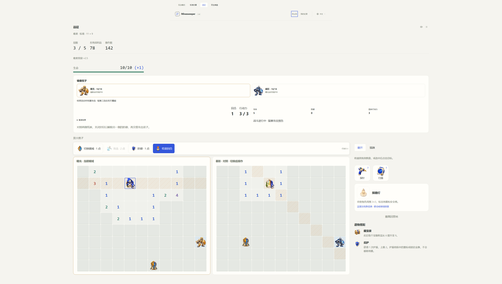
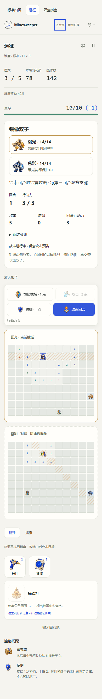

# Mirror Twins

Mirror Twins is the third Expedition boss family. Its two minefields share coordinates but never share a mine. One explorer has a remembered position in each realm; switching resumes that position while health, tools, AP and the expedition build stay shared.

## Encounter schedule

Boss checkpoints keep the selected difficulty's existing schedule. The first encounter is selected by `seed % 4`: Bastion Guardian, Brood Queen, Mirror Twins or [Magnetic Knight](magnetic-knight.md). Each later checkpoint advances one place, without an immediate repeat. Short runs can encounter any family.

| Difficulty | Checkpoint floors | Each realm | Mines per realm | Health per twin |
| ---------- | ----------------- | ---------- | --------------- | --------------- |
| Relaxed    | 3                 | 11 × 9     | 17              | 14              |
| Standard   | 3, 5              | 11 × 9     | 17              | 14              |
| Advanced   | 3, 7              | 13 × 11    | 24              | 16              |
| Expert     | 3, 6, 9           | 13 × 11    | 24              | 16              |
| Abyss      | 4, 8, 12          | 15 × 13    | 33              | 18              |

## Deduction and objectives

- **Mine exclusion:** a mine at a coordinate in Dawn proves the same coordinate safe in Dusk, and vice versa. Numbers still count the eight neighbors on their own board. A normal flag is a hypothesis. A gold, confirmed mine additionally marks its counterpart as surveyed safe and clears a conflicting ordinary flag there, without revealing its number.
- **Crossed seals:** each realm contains one advertised, initially covered numbered seal. Reveal it, correctly flag its surrounding mines, and stand on it or beside it to disable it for 1 AP. Dawn's seal protects Dusk; Dusk's seal protects Dawn. Incorrect calibration spends the AP and inflicts 5 damage, ignoring armor. Disabling a seal is permanent.
- **Reflection:** while both twins live, hitting a twin makes it immune to another strike until the other twin is hit. This requires alternating targets after breaking their seals. Invalid attacks consume nothing.
- **Two positions:** Shift costs 1 AP and resumes the explorer's last position in the other realm. It cannot teleport into unknown terrain or restore an older resource snapshot. The left/top board is interactive; the second is a labeled, read-only comparison. Switching exchanges their contents. Coordinate focus highlights the matching cell on the other board.

An attack costs 2 AP and requires an orthogonally adjacent position. Both twins must reach zero health to finish the room. The survivor loses reflection; future attacks rise from 5 to 7 damage. Defeating a twin immediately cancels that twin's already announced attack.

## Turn rhythm

Dawn alternates horizontal and vertical attacks. Dusk alternates the two diagonal directions. Each footprint is aimed at that realm's remembered explorer position when the turn begins. Both forecasts are frozen: moving, flagging, hovering and switching cannot retarget them.

**Every third turn is a shared recharge turn with no enemy attack.** This creates a visible opening for positioning and damage, including narrow numbered lanes where an attack and an escape might exceed a base explorer's AP. The panel announces the recharge turn explicitly.

Only **End turn** resolves damage, and only the currently active realm can hit the explorer. Time spent thinking has no cost. The shared rules for defense, bracing, shields, revival and recovery still apply. Victory fully heals the explorer, grants one shield up to the cap, pays the ordinary floor reward once and opens the relic dialog.

## Build integration

The encounter reads the same derived attack, defense and AP as the other bosses. There is no separate mirror power scale or currency reward for switching.

- Focus lens refunds the first successful seal interaction each turn. Breach sigil refunds the first successful seal disable each floor, as it does for a Bastion control.
- Archaeologist excavation targets the active realm's remaining seal. Career skills remain once per floor across both boards.
- First-strike bonuses, movement discounts, reserve AP, shields and survival reactions retain their existing limits.
- Discovery and unique-travel thresholds count both realms. Switching does not add discoveries, revisit bonuses, inventory or fresh relic charges.

The emphasis remains on bounded equipment and in-run relic choices. Permanent training is unchanged.

## Generation and ownership

`mirror-generation.ts` partitions one seeded Fisher–Yates shuffle into two exact, disjoint mine sets. Both realms have a natural zero opening, varied entrance and seal positions, and less than half the board revealed initially. Every retained safe square is orthogonally connected to the entrance; unreachable safe pockets become walls. The shared boss coordinate is excluded from walking.

Candidate acceptance solves both boards using public clue deductions, flags obtained from those deductions, and the mine-exclusion rule. It only opens justified cells reachable from the known floor. Hidden mine bits are used by placement and reveal resolution, never by the deduction decision. A bounded candidate search includes a deterministic fallback sequence checked for all supported arena sizes.

Authored contracts live in `src/types/mirror.d.ts`. `mirror-state.ts` owns room snapshots and cross-realm information; `mirror-battle.ts` owns entry, shifting, seals, strikes and forecasts. The shared tactical orchestrator still charges AP and applies combat effects. `ExpeditionSession` remains the sole journal and settlement owner. The preview board derives a view without dispatching an action.

This release advances the single expedition rules revision to **2**. Version-4 journals from revision 1 return their checkpointed extraction value to camp; versions 1–3 retain the one-time 200-supply transition policy. Permanent progress stays intact. No previous mirror or combat engine is retained. See [save maintenance](save-policy.md).

## Acceptance and artwork

Behavior coverage includes exact mine exclusion, natural blank expansion, public solvability, varied layouts, the fallback sequence, poisoned hidden data, baseline wins in all five tiers, crossed seals, wrong calibrations, reflection, recharge timing, shared resources, build effects and retirement of the previous revision. The baseline acceptance player uses public information and accepted journal actions with zero tools, zero shields and no paid build. These are automated viability checks; they do not measure human win rates or establish final balance.

Browser acceptance covers both board slots, read-only input, covered clue privacy, shift/reload, tool cancellation, seal clicks and the victory dialog in English, Chinese and Japanese at 320, 390, 1280 and 3840 CSS pixels. The mobile touch regression also includes Mirror Twins. Desktop Chromium touch emulation is not a physical-device Safari test.

Four independent PNG assets are included, with real transparency: Dawn, Dusk, the seal and the shift portal. Defeated twins and disabled seals use muted versions of their own artwork. [Prompts and provenance](mirror-artwork.md).

