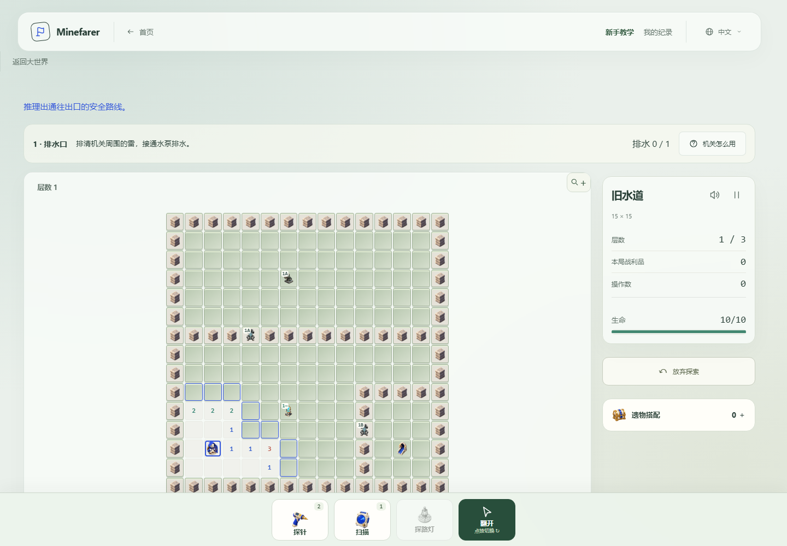
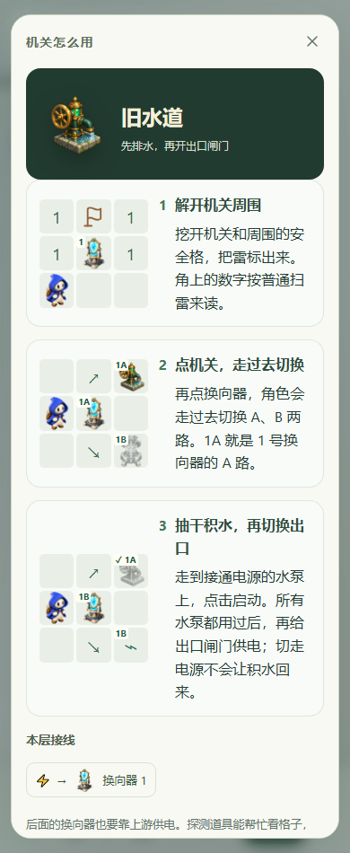

# Old Waterway

The fourth stage of the watchtower chapter follows [Ridge Observatory](ridge-observatory.md). After the survey, enter at the pump on the south side of North Road. **Find the beacon in the waterway** is accepted when returning to the world, including from a save that already finished the survey. No extra camp conversation or delivery is required. The three-floor stage awards **140 supplies once**; its task adds no second currency reward.

## Difficulty and layout

| Floor               | Board   | Playable cells | Mines | Mine density | Initially revealed | Manual excavations in the verification route |
| ------------------- | ------- | -------------- | ----- | ------------ | ------------------ | -------------------------------------------- |
| The drain           | 15 × 15 | 150            | 30    | 20.0%        | 16                 | 51                                           |
| The sluice chambers | 17 × 17 | 199            | 44    | 22.1%        | 17                 | 76                                           |
| Below the signal    | 19 × 17 | 222            | 56    | 25.2%        | 15                 | 94                                           |

Playable cells exclude permanent walls and include gate tiles. Initial exposure is measured with the starting explorer and no equipment. Manual excavations count accepted single-cell reveal actions, not cells opened by a zero flood. These are reproducible properties of the verification route, not a claim that every player will take the same route or number of actions.

The boards are explicit, authored cell maps. An offline placement search helped find candidates; no search, seed pool or answer-based fallback ships in the game. Every safe non-wall cell connects orthogonally to the entrance when the relevant gates are open. Isolated ordinary safe pockets on the final map were sealed with permanent walls. All selectors and pumps have at least one neighboring mine, so their positions do not become free zero-clear areas. Numbers keep their normal eight-neighbor meaning.

The verification solver chooses flags and excavations only from visible numbers and published circuit labels. It completes all three floors without probes, skills, damage or hidden-answer guesses. Greater board size is accompanied by more actual deduction, rather than a large decorative safe zone around a mechanism.

## Drainage

The power network reuses the previous stage's A/B selectors. Reveal a device, clear its safe neighbors and flag its mines, then walk over and click to operate it. A pump also needs its upstream branch powered. Using it drains that chamber permanently for the attempt. Switching power away does not refill it. Every pump must be used before the floor exit can complete.

- **The drain:** send selector 1 to A, drain the northern chamber, then use B for the exit.
- **The sluice chambers:** 1A supplies selector 2. Drain its western pump on 2A, then its eastern pump on 2B. Return selector 1 to B for the exit.
- **Below the signal:** the larger eastern chamber has two pumps on 2B. Both must be reached and drained before opening the final exit on 1B.

Opening a gate reveals its doorway only. It neither clears the room beyond nor changes mines or clue values. Flags, suspected-safe marks, quick-open, tools, profession abilities and health rules remain shared with expedition play. Equipment, titles and camp purchases are retained; this stage does not impose a separate fixed loadout.

The contextual help uses the same illustrated three-step modal as boss encounters. It shows the pump artwork and the current floor's upstream wiring. Accepted pump actions turn the handwheel and lower a local waterline before the next conversation; reduced-motion players receive the completed visual state directly. Keyboard, right-click, touch-hold and mobile scrolling remain available.

## Story and persistence

Nia watches the water while the player clears a route. Fresh marks on the gates suggest someone has been here recently. The beacon is tied in place, rather than an object swept away by the flood. The guardian finally answers: it claims the upper door is keeping something **in**. The discovery happens at the site and points toward the control room. The control-room stage and chapter boss are still future content.

Dialogue uses the existing chibi cast, typewriter, distinct voices, beacon playback and character motion. When the player answers the guardian or Lumi, that character stays on screen. The atlas records the discovery, and Nia can discuss it at the shared camp.

`old-waterway` has its own campaign slot and `old-waterway-v1` content revision. The shared authored-power loader preserves each map's exact terrain, while the stage catalog owns its physical entrance and prerequisite. Accepted intents rebuild drainage and routing; completed conversations and the first-clear bit persist independently. Settlement records `beacon-recovered`, completes the task and adds the stage reward once. Prior campaign slots, camp purchases and a paused roguelite remain untouched.

## Verification

`tests/waterway-helpers.ts` supplies the public-clue route. Domain tests cover its complete solution, safe connectivity, truthful clues, density, initial exposure, minimum excavation work, persistent drainage and gate routing. Session tests reload every accepted action and check the entrance prerequisite, independent journals, single settlement, retry and future-version write protection.

`tests/browser/waterway.mjs` exercises the physical entrance and full stage through mouse and touch input, then checks ending recovery, camp conversation and atlas progress. English and Japanese receive entrance and device-guide checks. A separate keyboard path checks pump animation before dialogue, typewriter audio and mute. The original pump and its generation prompt are documented in [Story artwork](story-artwork.md).
