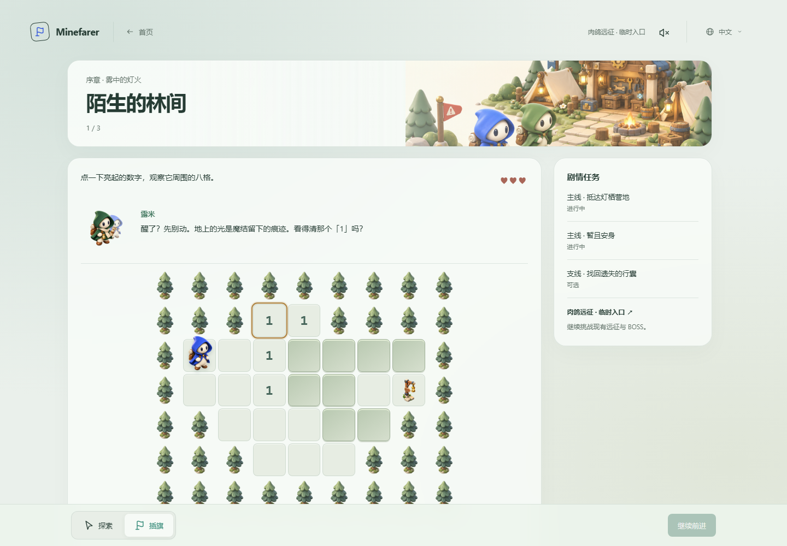
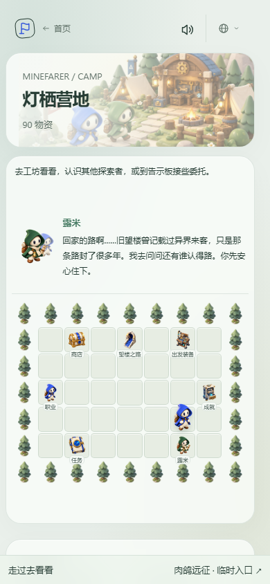

# Prologue and first arrival

Minefarer begins its story with **A light in the mist**, three authored scenes leading to **Lanternrest**. Lumi, a green-cloaked trail guide, finds the displaced traveler and helps them read the traces of leyline knots. The traveler wants to return home. At camp, Lumi offers a lead: an old watchtower that recorded visitors from other worlds.

This delivery opens the prologue and camp. It does not implement the first full 5+1 chapter, the persistent overworld or configurable Recollection. Those remain in [Roadmap II](https://github.com/shipiyouniao/minefarer/issues/55).

## Teaching in the scene

There is no tutorial modal. A short conversation, one current objective and a highlighted cell sit beside the actual board. Progress follows accepted interactions:

1. **The unfamiliar clearing:** inspect a revealed number and its eight-neighbor outline; identify and flag the only covered neighbor; reveal ground proven safe; walk to the exit.
2. **Along the old trail:** open connected blank ground, see its numbered boundary, and optionally recover a lost satchel.
3. **Lights beyond the trees:** use the same visible clues and safe-path movement to reach the camp.

Mouse clicks, touch taps and Enter/Space activate cells. Right-click, touch hold, F, or the fixed Flag control mark a covered cell. The fixed Explore control restores ordinary interaction. Arrow keys move board focus. A touch pan cancels a pending hold; scrolling is not disabled inside the board. The traveler walks over revealed safe cells and approaches a covered target from the closest reachable neighbor. Clicking the exit first moves there; a separate Continue action changes scenes, so revealing or crossing it never unexpectedly ends exploration.

The maps in `src/game/story-content.ts` describe actual terrain, mines and objectives. They are not generator seeds. Clues derive from the explicit mine set. Covered mine bits do not appear in DOM attributes, labels or path planning. The behavior suite solves each map from public clue constraints and verifies a damage-free route to all objectives.

The prologue supplies three teaching hearts. A triggered knot costs one heart and leaves an immutable warning; the character stays on the last safe cell. A failure restarts the current authored stretch after a rest. These introductory scenes are a teaching departure before camp preparation: they do not count as ordinary runs or apply a selected profession's combat kit. Later campaign stages must snapshot and apply the shared prepared build.

## Lanternrest

Camp is a safe, persistent board. Walk to a landmark to visit the existing shared services:

| Landmark       | Service                                                            |
| -------------- | ------------------------------------------------------------------ |
| Supply stall   | Existing shop and price-sorted category/detail browsing            |
| Workshop       | Existing bounded departure equipment                               |
| Explorer       | Existing professions and next-departure selection                  |
| Archive        | Existing achievements and title rewards                            |
| Notice board   | Existing ordinary missions                                         |
| Lumi's lantern | First camp conversation and main objective                         |
| Northern road  | The next chapter's location, clearly marked as still being charted |

The next chapter is not enterable in this release. A conversation can complete the initial camp objective without pretending to unlock content that has not shipped. Story objectives remain visibly separate from ordinary missions. Safe camp routes and facilities stay usable on return. Facility detail screens reuse the established templates, catalogs and business rules.

## Shared progress and temporary roguelite access

An explicit **Roguelite · temporary entrance** remains accessible during the prologue and from camp. It opens the existing expedition mode, including current difficulties, random boards, bosses, purchases, achievements and saved run. Keep this entrance until the full Recollection location replaces it; do not make unfinished story content a gate for existing players.

All permanent progress stays in the existing `minesweeper.variants.v1.expedition` envelope. Additive `story` and `loadout` fields preserve the separate roguelite journal and records. The camp session rereads the complete envelope before a mutation. Roguelite terminal settlement preserves story metadata. Camp profession/equipment selections are shared, while an active roguelite retains its frozen departure snapshot.

Story teaching does not farm ordinary missions or achievements. Reaching camp grants **60 supplies once**; returning the optional satchel grants **30 supplies once**. Task completion, claim records, journal removal and the shared wallet update are committed in one storage write. Reopening or refreshing camp does not pay again. Ordinary mission/achievement claim buttons retain their existing behavior.

Current story attempts replay only the current authored-content revision. Incompatible attempts return to camp, preserve durable objectives and receive **200 supplies once**. No retired content engine is kept for replay. Malformed current journals restart the introduction while preserving permanent camp data. Storage failures show a warning.

## Art and accessibility

Story art uses the existing chibi proportions, simple oval faces, soft 3D materials and brass/leather accents. The original blue explorer remains the protagonist. Lumi and the camp illustration match that asset family; the discarded painterly concepts are not shipped. See [story artwork](story-artwork.md).

Scene dialogue is inline rather than modal. On a fresh start, the traveler blinks awake and the clearing comes into focus over 2.2 seconds. The opening can be skipped with its button or Escape. Returning to a saved attempt starts directly on the board.

Short exchanges reveal one grapheme at a time. Continue first finishes the current sentence, then advances to the next speaker; the board objective remains visible throughout. Active speakers move forward and nod, point or greet. Walking up to Lumi produces a greeting from both characters. Finding the satchel lifts its icon above the traveler, and the first camp conversation passes it between the two portraits when it was recovered. These effects belong to `StoryPerformance`, separate from game rules and the saved action journal. They cannot move a character, advance a floor or pay a reward.

Lumi, all eight professions and all eight boss families have distinct synthesized syllables. Speech is louder than the previous dialogue mix, while ordinary game effects retain their existing levels. Punctuation stays silent. All speech follows the shared mute setting; route changes and backgrounding cancel it. Timed dialogue cannot activate browser audio by itself: a direct link remains silent until the player interacts. Normal entry from the homepage supplies that gesture.

Reduced motion presents complete sentences and removes the opening, character gestures, walking and beacon animation. Number scopes have outlines, targets have visible borders, flags use distinct shapes and triggered warnings are immutable. Keyboard focus sits above the cells. The board fits available width and laptop height; the fixed controls stay outside filtered containers. All story copy is provided in English, Chinese and Japanese.

The prologue's soft green covered-tile material is shared by classic, twin, sonar, survey, expedition, boss and interactive practice boards through `src/tiles.css` and three design tokens. State-specific flags, confirmed information, damage warnings and keyboard outlines remain above that base material.

The project continues to use module-scoped `.d.ts` contracts, pure rules, session ownership and both native and legacy TypeScript validation.
