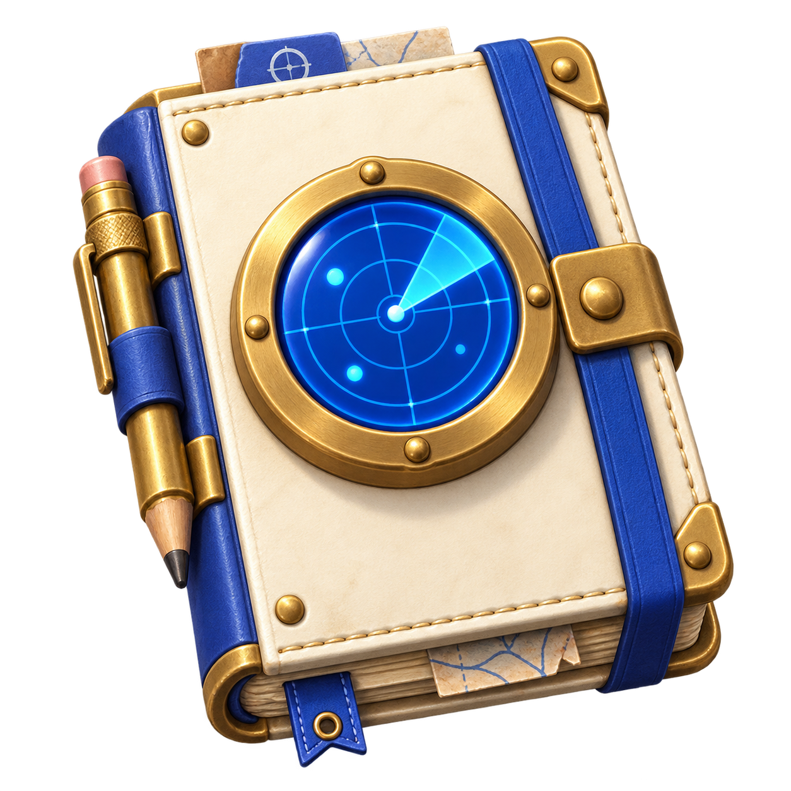
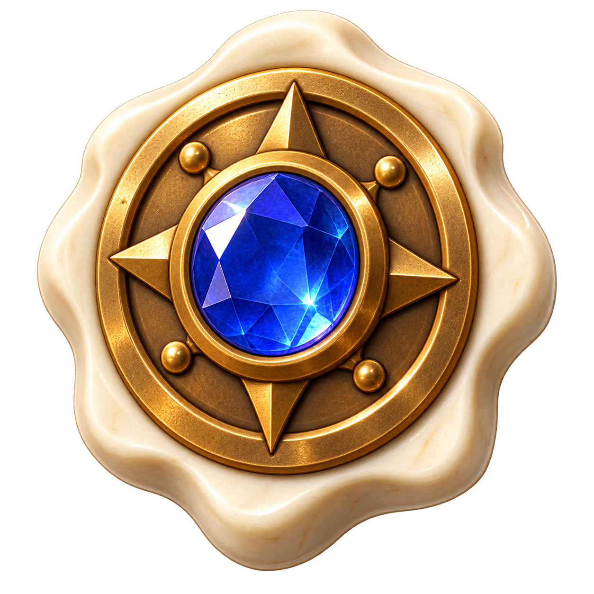

# Relic theme artwork

Generated with the built-in image tool on September 4, 2026. Selected transparent PNGs are copied unchanged into `public/assets/dungeon/`, under the project MIT license. The four images identify purchasable themes; rewards within a theme share its image and retain distinct text names and descriptions. These are not eight separate relic illustrations.

## survey-notes.png

Use case: stylized-concept. Create a production game icon for a permanent relic theme pack in a minimal Minesweeper roguelite: a small ivory field notebook with a chunky cobalt radar disk on its cover and a brass pencil. One centered complete object, restrained 3D clay/ceramic miniature, orthographic three-quarter front view, soft upper-left studio light, large simple shapes and clean silhouette readable at 48 pixels. Palette warm ivory #fffefa, cobalt #3457db and warm brass. Square image, subject occupies about 80 percent, REAL transparent alpha background, isolated subject, no floor, no scene, no painted checkerboard, no words, no watermark, no border.

## guardian-crests.png

Use case: stylized-concept. Create a production game icon for a permanent relic theme pack in a minimal Minesweeper roguelite: a chunky cobalt shield with ivory rim and a brass star-shaped central crest. One centered complete object, restrained 3D clay/ceramic miniature, orthographic three-quarter front view, soft upper-left studio light, large simple shapes and clean silhouette readable at 48 pixels. Palette warm ivory #fffefa, cobalt #3457db and warm brass. Square image, subject occupies about 80 percent, REAL transparent alpha background, isolated subject, no floor, no scene, no painted checkerboard, no words, no watermark, no border.

## survival-charms.png

Use case: stylized-concept. Create a production game icon for a permanent relic theme pack in a minimal Minesweeper roguelite: an ivory ceramic heart amulet wrapped in a cobalt bandage with a small brass clasp. One centered complete object, restrained 3D clay/ceramic miniature, orthographic three-quarter front view, soft upper-left studio light, large simple shapes and clean silhouette readable at 48 pixels. Palette warm ivory #fffefa, cobalt #3457db and warm brass. Square image, subject occupies about 80 percent, REAL transparent alpha background, isolated subject, no floor, no scene, no painted checkerboard, no words, no watermark, no border.

## prospector-seals.png

Use case: stylized-concept. Create a production game icon for a permanent relic theme pack in a minimal Minesweeper roguelite: a small warm brass treasure seal with an ivory rim and a single cobalt crystal inset. One centered complete object, restrained 3D clay/ceramic miniature, orthographic three-quarter front view, soft upper-left studio light, large simple shapes and clean silhouette readable at 48 pixels. Palette warm ivory #fffefa, cobalt #3457db and warm brass. Square image, subject occupies about 80 percent, REAL transparent alpha background, isolated subject, no floor, no scene, no painted checkerboard, no words, no watermark, no border.

## Survival charm revision

The initial output used an anatomical heart. It is not shipped. The final image-tool edit used that output as its only reference to replace it with a symbolic heart silhouette:

Use case: stylized-concept. Replace this anatomical heart with a very simple symbolic heart-shaped ceramic amulet: the familiar two rounded lobes and pointed bottom love-heart silhouette, NOT an organ, NO arteries, NO veins, NO tubes, NO anatomical details. Warm ivory smooth matte clay, one broad cobalt bandage diagonally across the heart, one small brass clasp. Minimal charming game icon matching rounded clay toys. One isolated object on REAL transparent alpha background, square canvas, crisp large shapes readable at 48 pixels, no text, no scenery, no floor or painted checkerboard. Keep a clean ivory/cobalt/brass palette and upper-left studio lighting.
