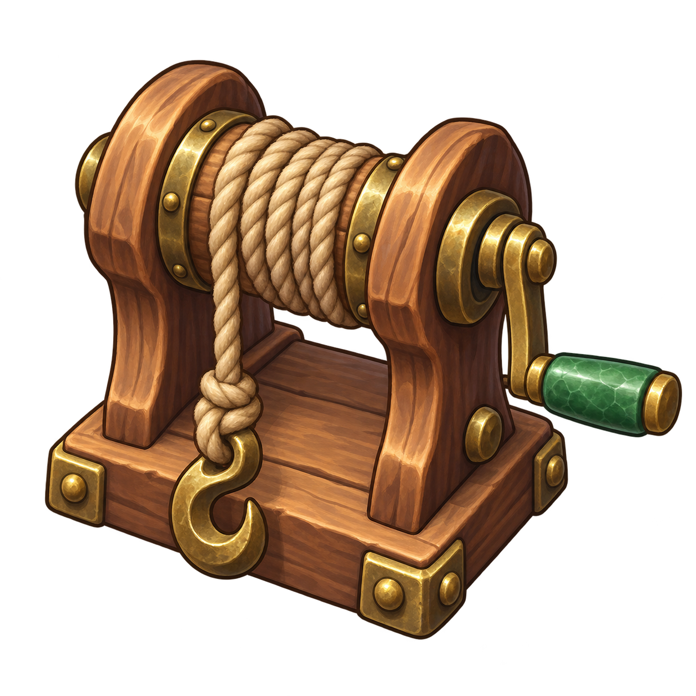
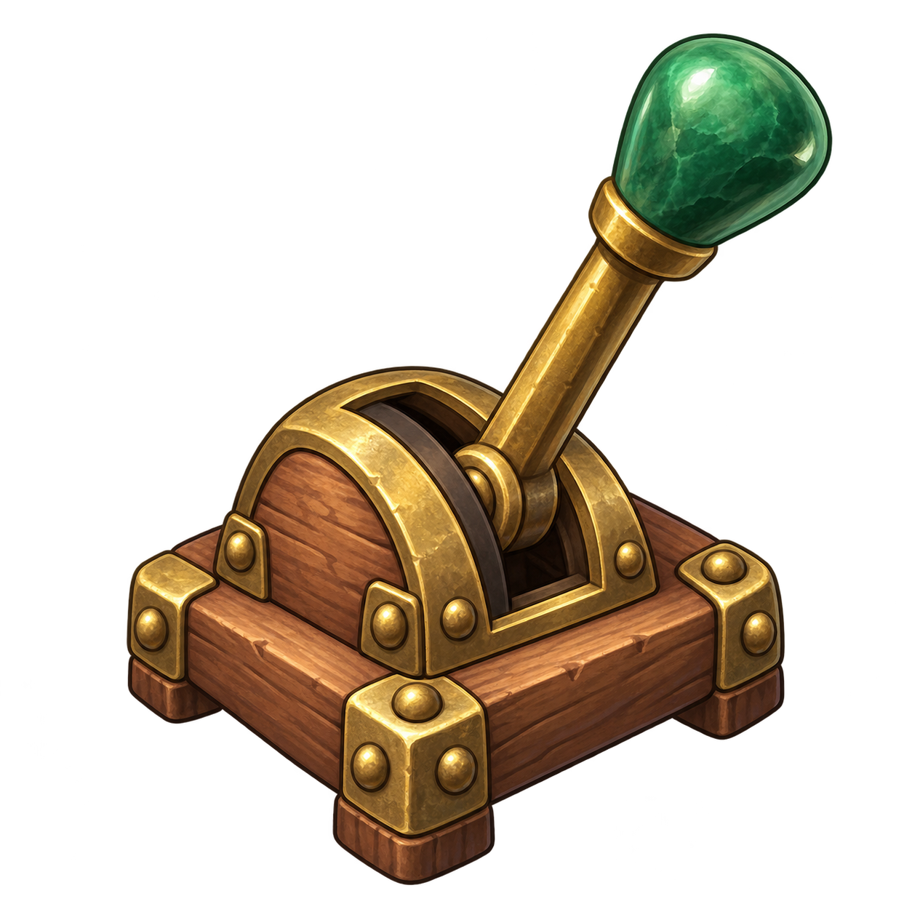
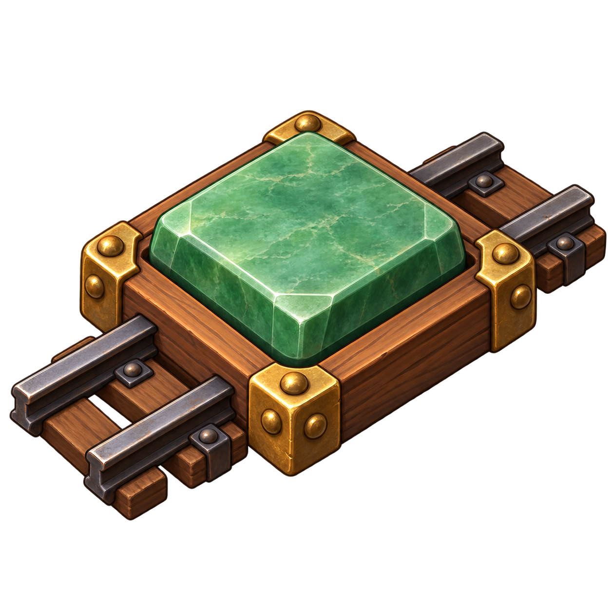
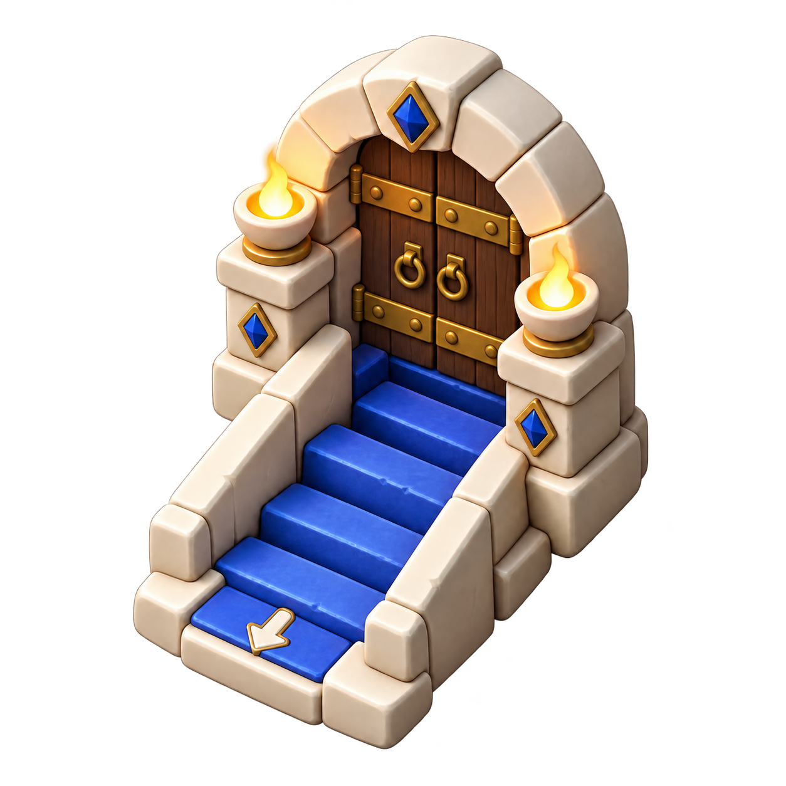
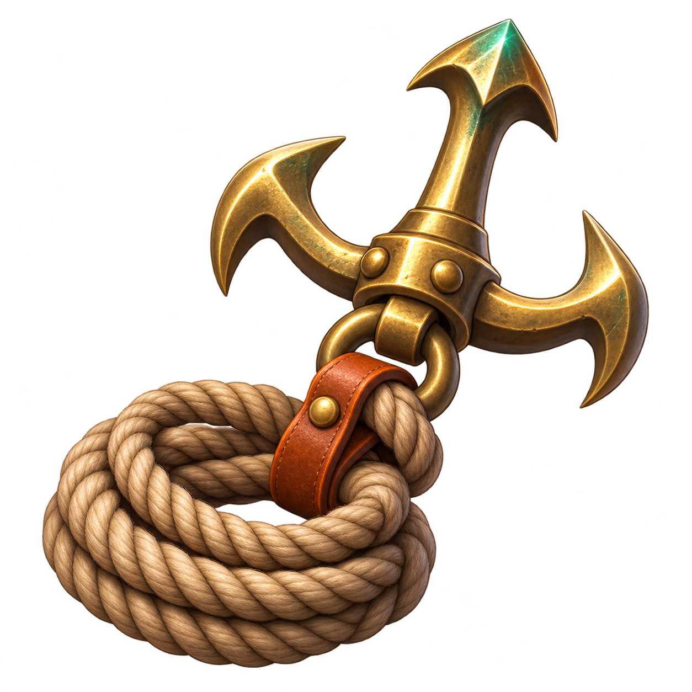

# Rescue controls, profession and exit artwork

These six transparent PNG assets were generated with the built-in image generation tool. The existing Engineer and open exit sprites supplied references for the Rescuer and closed exit. Original image outputs are preserved; the repository contains the selected results with alpha intact. Direction arrows, control numbers and teaching diagrams remain accessible HTML/CSS.

## rail-winch



Full generation prompt:

```text
Use case: stylized-concept. Asset type: transparent game prop sprite for Minefarer, a restrained chibi fantasy Minesweeper adventure. Generate one compact hand-operated mine winch: a short horizontal spool wound with thick rope, held between rounded warm-brown wooden supports on a square base, aged brass fittings, one clearly readable crank with a jade-green grip. Match a hand-painted toy-like JRPG inventory illustration: rounded chunky proportions, soft painted highlights, dark warm edge definition, low detail readable at 40 pixels, three-quarter view from slightly above. Single isolated centered object occupying about 80 percent of a square canvas, full object visible. Genuine transparent background and preserved alpha, no floor scenery, no frame, no letters, no arrows, no watermark. This is the same woodland wood/brass/jade material family as a little wooden minecart, not industrial realistic machinery.
```

## rail-lever



Full generation prompt:

```text
Use case: stylized-concept. Asset type: transparent game prop sprite for Minefarer, a restrained chibi fantasy Minesweeper adventure. Generate one sturdy track-switch lever: a rounded squat square wood-and-brass pedestal, a visible curved slot, and one long brass handle leaning slightly right with a large jade-green rounded grip. Match a hand-painted toy-like JRPG inventory illustration: chunky readable silhouette, warm wood, aged brass, soft painted highlights, dark warm edge definition, few details readable at 40 pixels, three-quarter view from slightly above. Single isolated centered object occupying about 80 percent of a square canvas, full object visible. Genuine transparent background and preserved alpha, no floor scenery, no frame, no text, no digits, no arrows, no watermark. Same woodland wood/brass/jade material family as a little wooden minecart; this is a tangible physical lever, not a flat user-interface symbol.
```

## rail-brake



Full generation prompt:

```text
Use case: stylized-concept. Asset type: transparent game prop sprite for Minefarer, a restrained chibi fantasy Minesweeper adventure. Generate one chunky square pressure-button brake platform for a small minecart: a broad raised jade-green square push plate with bevelled corners, mounted in a warm wooden base with brass corner brackets, and two very short dark-metal rail stubs entering and leaving the base. Hand-painted toy-like JRPG prop art, rounded compact proportions, soft highlights, dark warm edge definition, bold simple silhouette readable at 40 pixels, three-quarter view from slightly above. A single isolated centered object occupying about 80 percent of a square canvas, full object visible. Genuine transparent background and preserved alpha. No scenery, no frame, no text, no digits, no arrows, no watermark. Same wood/brass/jade palette as a little wooden minecart.
```

## exit-closed



Full generation prompt:

```text
Edit this game exit sprite to show exactly the same staircase and stone arch, perspective, canvas size, torches, blue gems and outer silhouette. Close the doorway at the top of the stairs with two chunky dark warm wooden hinged door leaves, brass bands and small handles meeting in the middle. The stairs remain visible. Match this rounded toy-like chibi fantasy 3D-painted game art precisely. Everything except the empty doorway stays unchanged. Genuine transparent alpha background, no scenery, no text or interface frame. This is an animation endpoint matched to the original open doorway.
```

## rescuer


Full generation prompt:

```text
Use this game character as a style reference and generate a distinct Rescuer profession pawn for the same Minefarer game. Same full-body chibi toy proportions, cream face, large simple dark oval eyes, no detailed mouth, three-quarter stance facing RIGHT, soft tactile painted 3D materials. Change outfit to a muted burnt-orange hooded rescue cape, pale cream tunic, brown leather gloves boots belt and small backpack; carry a chunky brass grappling hook and a clearly readable coil of rope at the right side. No construction helmet, no shield, no wrench. Bold friendly silhouette readable at 40 pixels, complete centered body about 85 percent canvas, transparent background with genuine alpha. No text, no frame, no ground or scenery.
```

## skill-rescuer



Full generation prompt:

```text
Generate one transparent game skill icon for Minefarer: a chunky brass three-pronged grappling hook attached to a thick curled rescue rope, a small muted burnt-orange leather strap, with a restrained jade glint at the hook tip. Rounded toy-like chibi fantasy 3D-painted materials, warm leather brass and hemp, soft tactile highlights and simple bold silhouette readable at 40 pixels. Single isolated centered object about 85 percent of square canvas, full object visible, genuine transparent alpha background, no ground, no text, no numbers, no frame, no scenery. An equipment illustration not a flat symbol.
```
