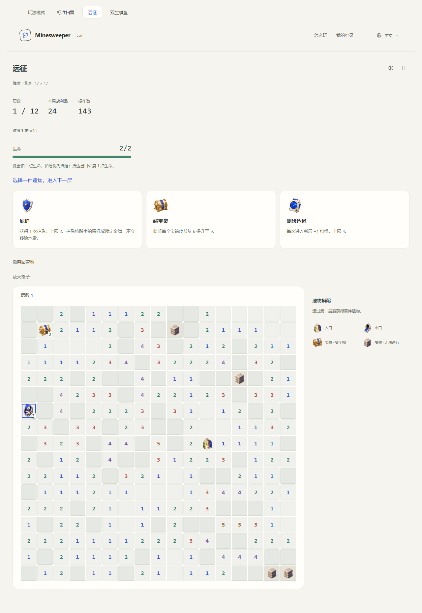
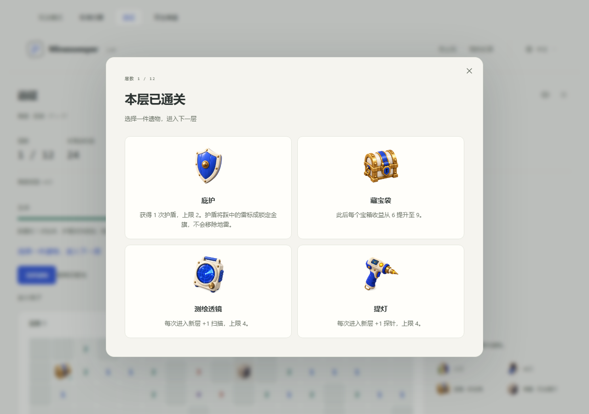
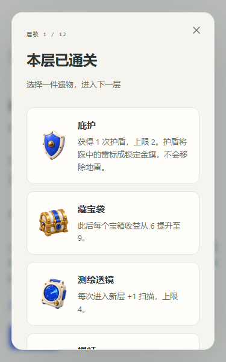
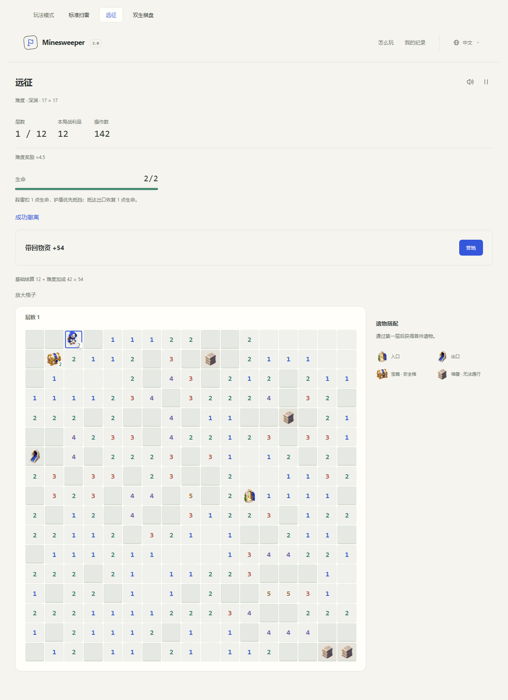
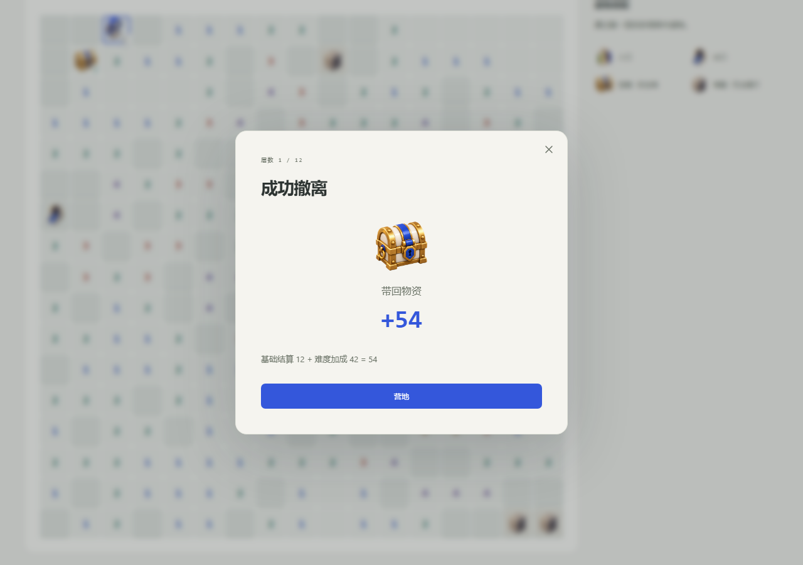

# Expedition dialogs and scrolling

Clearing an ordinary floor or a non-final boss room opens a relic dialog over the completed board. Each choice includes its existing artwork, name and full effect. Selecting a card claims that relic and advances exactly once. The Archaeologist's fourth offer uses a balanced two-column layout; narrow screens stack compact cards and scroll within the dialog.

Escape or the close button dismisses the dialog without spending, choosing or skipping anything. The **Choose a relic** button reopens the same offers. A recovered journal opens its pending reward again. When the available pool is exhausted, **Next floor** remains available in the dialog. The final floor still uses the expedition victory and settlement flow.

The native modal keeps background controls inert. Initial focus announces the title; Tab reaches the choices and Enter or Space activates a card. Dismissal returns focus to the reopening button; an accepted selection moves focus to the new board. Pausing hides the reward presentation and resuming brings it back. Closing or reopening the popup does not append a journal action, change the seed, regenerate offers or award supplies.

## Presentation ownership

`ExpeditionDialog` owns the native dialog, automatic opening and focus cleanup for rewards and results. `VariantView` passes the current run and visibility state to it after painting the board. `VariantApp` permits relic/next-floor commands from the reward presentation and returning to camp from the result presentation, while retaining other modal guards. Pure templates reuse the localized relic catalog, settlement calculation and generated sprites. Session and domain reward rules are unchanged; no save migration is needed.

## Expedition settlement

Victory, defeat and extraction automatically open a result dialog showing the outcome, reached floor, supplies brought back and the existing base/bonus breakdown. Returning to camp closes the dialog and focuses the camp heading. Escape or close leaves a **View results** button on the completed board so the player can inspect the board and reopen the same result.

Settlement remains atomic in `ExpeditionSession.dispatch`: supplies and the record are saved and the journal is cleared before the dialog appears. Dismissal, reopening and returning to camp cannot award currency a second time. Reloading a completed expedition opens the camp with its saved result record; pending inter-floor rewards still reopen after reload. The modal deliberately does not invent a second persisted settlement state.

## Board wheel behavior

The shared `.board-viewport` previously used `overscroll-behavior: contain` on both axes. This stopped a vertical wheel gesture from reaching the page even when a fitted board had nothing to scroll internally.

The viewport now uses `overscroll-behavior: contain auto`: horizontal panning remains local, while vertical scrolling chains normally. Fitted Classic, Twin and Expedition boards allow page scrolling under the pointer. Enlarged boards scroll internally first, then continue into the page at their top or bottom edge. There is no custom wheel listener or forced conversion of vertical gestures to horizontal movement. The reward modal intentionally contains its own scrolling and locks the background page while open.

## Browser regression checks

`tests/browser/rewards.mjs` runs against a built preview or the deployed site, in a fresh browser context with disposable storage. Fixtures are generated from accepted domain actions and replayed through the real repository/session path, including an actual exit click and the final attack in a boss room.

Prepare with `npm test`, `npm run build`, and `npm run preview -- --host 127.0.0.1 --port 4173`. With Playwright available, run `node tests/browser/rewards.mjs`. Optional environment variables:

- `PLAYWRIGHT_MODULE`: path to an existing Playwright installation; otherwise Node resolves `playwright` normally. This optional browser tool is not a production dependency.
- `BROWSER_CHANNEL`: installed browser channel, such as `msedge`; otherwise use Playwright's Chromium.
- `GAME_URL`: site base URL, including the trailing slash. The default is `http://127.0.0.1:4173/Minesweeper-2.0/`.

The checks cover ordinary/boss transitions, three/four/zero offers, native keyboard containment, dismissal and reopening, exactly-once selection, reload recovery, pause/resume, three languages, widths of 320/760/1280/3840 pixels, all three modes' wheel behavior, and both enlarged-board scroll boundaries. Victory, defeat and extraction checks additionally verify saved supplies, a single result record, cleared journals and no duplicate payout on modal/camp/reload navigation. Browser errors fail the run. Screenshots are written under `.native/reward-ui/`; `--before` captures the old inline layout when pointed at its release. The regular unit suite and both compiler pipelines remain separate required checks.

## Screenshots

Previous inline layout, from release `6776679`:

Current desktop and narrow-screen dialog:

Settlement on desktop and a narrow screen:

Previous inline result banner, from release `d826812` (captured with `--before-result`):

