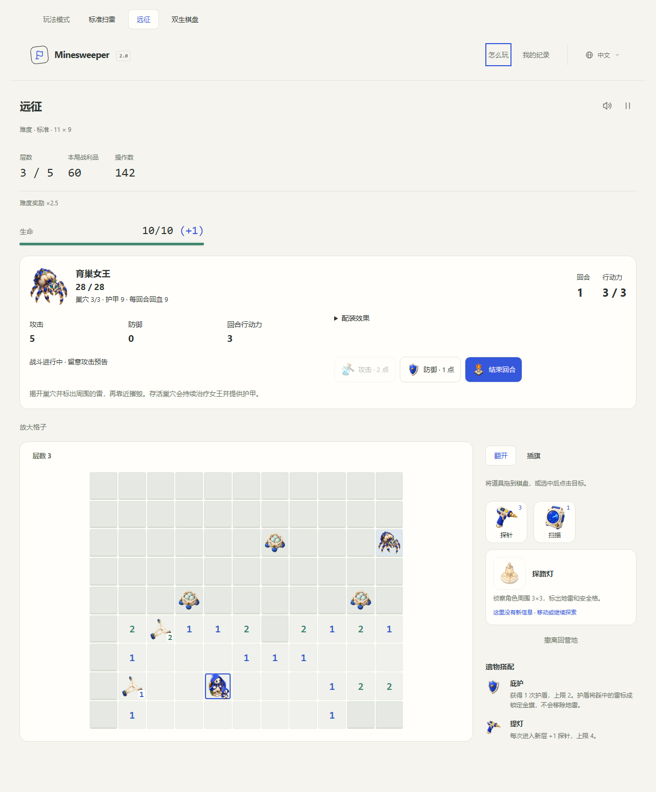
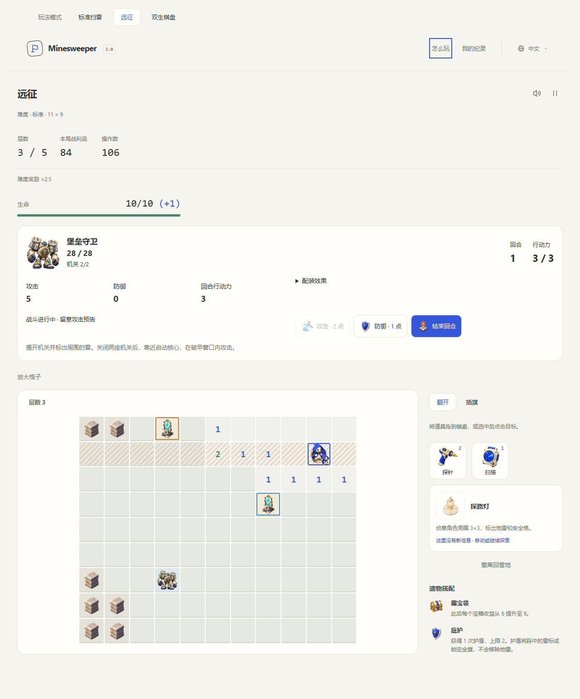

# Tactical encounters and expedition builds

New departures use the `tactics-v2` encounter revision. The first two bosses now connect mine deduction, regional objectives and a bounded character build. Older `bastion-v1` and `brood-v1` journals keep their original maps, damage, turns and rewards.

## Design goals

- Mine clues must matter to victory. The player reveals each objective, identifies its neighboring mines and calibrates it from the same or an adjacent square.
- Encounters retain unlimited thinking time. Only **End turn** resolves the committed enemy forecast.
- Clearing a nest has a permanent payoff. Reinforcements, armor and healing depend on surviving nests.
- Permanent growth is small and finite; equipment selection and relic rewards provide most build strength.
- A free Explorer must be able to win without information tools or a paid build. Stronger builds still engage with the objectives.

## Arena generation

The generator selects an exact mine count by seeded Fisher–Yates shuffle. The three arena dimensions contain **17 / 24 / 33 mines** (about 17%) rather than four isolated corner mines. Entrance positions and objectives vary with the seed. A natural zero flood opens the starting area; accepted openings reveal less than half the board, and every objective starts covered with a nonzero clue.

A public-information solver uses revealed clue constraints, known flags and subset subtraction. It only opens proven-safe frontier cells connected to the existing explored floor. Generation accepts a layout only when every playable safe cell can be revealed by that process. Unreachable safe pockets become walls. The boss occupies a safe cell with at least three safe orthogonal approaches; removing that cell must not disconnect the playable floor. Objective locations are public, but their numbers remain hidden until revealed.

Generation tries 128 seeded candidates, then a separately tested 128-candidate deterministic fallback sequence. Dimensions and objective counts are checked by the test suite. This is a guarantee about supported generation and logical terrain access, not a claim that every combat decision or every tool-spending strategy wins.

## Shared combat and vitality table

| Rule                                                    |                                        Value |
| ------------------------------------------------------- | -------------------------------------------: |
| Starting health                                         |                                           10 |
| Base attack                                             |                                            5 |
| Base defense                                            |                                            0 |
| Base AP each turn                                       |                                            3 |
| Maximum AP, including refunds                           |                                            5 |
| Move                                                    |                              1 AP per square |
| Reveal                                                  |                      Movement cost plus 1 AP |
| Strike                                                  |                                         2 AP |
| Tool, skill, objective, core priming, clearing or Brace |                                         1 AP |
| Flag or End turn                                        |                                         0 AP |
| Mine / incorrect objective calibration                  |                    5 damage, ignores defense |
| Brace                                                   | Reduces the current turn's enemy damage by 3 |
| Minimum enemy damage after defense and Brace            |                            1, before shields |
| Shield charge                                           |       Absorbs up to 5 damage; two-charge cap |
| Ordinary floor exit                                     |         Restores 5 health, up to the maximum |
| Boss victory                                            |            Full health and one shield charge |

Health is shared across ordinary floors and bosses. Shields remain visible beside it, for example `10/10 (+1)`. There is no damage immunity from stacking armor. Existing healing and revival relics use the new health scale: Field dressing restores 5 health, and Second wind revives with 5. Historical departures retain their old values.

The combat panel displays attack, defense, effective turn AP and expandable equipment/training/relic sources. The Duelist edge opening strike grants +4 damage under this revision. Reserve watch adds one AP to the next turn's actual allowance, capped at five. Existing once-per-floor and once-per-run effects keep their claim limits; entering a boss room does not refill tools or a spent profession skill.

## Bastion Guardian: regional controls and core windows

Two separated controls require local mine deduction. A correct calibration confirms neighboring mines and closes that defense permanently. Wrong flags with the correct count cause feedback damage and consume the action; an incorrect flag count cannot be submitted.

- **Amber suppressor:** future announced attacks fall from 5 to 3 damage. The already displayed forecast stays fixed.
- **Blue resonator:** core openings last four turns rather than two. Both defenses must be disabled before strikes are allowed.
- **Core:** when its window is closed, approach and click it, or use the panel's **Prime core** button, for 1 AP. Strike while the window is open; a later expired window can be primed again.

The guardian cycles through row, column and cross attacks. Health is 28 on Relaxed/Standard, 32 on Advanced/Expert and 36 on Abyss. The suppressor-first route offers earlier mitigation; the opposite route changes the approach and when the longer opening is obtained. The player still needs to reach the core and manage position, AP and forecast timing.

## Brood Queen: destroy the supply network

Three dispersed nests are independent objectives. Each surviving nest grants **3 armor and 3 healing per turn** to the queen. Three intact nests block direct strikes. After a nest is destroyed, its reinforcement supply stops permanently, the queen loses 3 health without an environmental killing blow, and its armor/healing contribution disappears. A strong offensive build can accept the cost of leaving some nests standing; the baseline build benefits heavily from destroying all three.

Every third turn, surviving nests can place two-turn eggs on nearby revealed safe cells. Placement is seeded and varies; it never displaces the explorer, another entity or a hidden clue. Eggs and hatchlings together are capped at three. Already spawned creatures remain after nest destruction, so clearing them still matters.

Hatchlings advance up to two safe squares along their announced path. The small ghost marks the committed destination. Each hatchling contributes 3 damage, and the queen contributes 5; overlapping sources add together before defense, Brace and shields. Intercepting a hatchling removes that source's forecast immediately. New hatchlings do not attack on the turn they hatch.

The queen attacks a frozen 3×3 area every third turn while nests survive. With no nests left, regeneration stops and her attack cadence becomes every second turn. Two removable webs begin on revealed floor. Webs, eggs and hatchlings can be cleared for 1 AP while adjacent. None changes the mine layout or the truth of its clues.

## Permanent purchases and bounded loadouts

The catalog now has **24 distinct gameplay purchases plus two one-time trainings**. Existing currency, ownership and prices are preserved. Equipment licenses are optional choices within the existing three-point Workshop budget; purchasing a license does not equip it automatically.

| Purchase           | Supplies | Budget | Effect                                                     |
| ------------------ | -------: | -----: | ---------------------------------------------------------- |
| Medical kit        |      400 |      1 | Starting/max health +2                                     |
| Focus lens         |      800 |      1 | First completed pylon or nest each turn refunds 1 AP       |
| Steel blade        |    1,000 |      2 | Attack +2                                                  |
| Plated vest        |    1,200 |      2 | Defense +1 against enemies                                 |
| Clearing hook      |    1,500 |      1 | First cleared web, egg or hatchling each turn refunds 1 AP |
| Field boots        |    1,800 |      2 | +1 AP on even combat turns                                 |
| Battle manual      |    2,200 |      — | Adds three combat relics to future reward pools            |
| Endurance training |    1,800 |      — | Once only: starting/max health +1                          |
| Weapon training    |    3,000 |      — | Once only: base attack +1                                  |

The Battle manual introduces **Tempered edge** (+3 attack), **Layered armor** (+1 defense) and **Tactics hourglass** (+1 AP each combat turn). They last for the current expedition. Their addition takes the maximum relic pool from 26 to 29. Permanent training never increases AP and cannot be purchased repeatedly. The archive remains the most expensive individual purchase at 7,500, within the existing ten-Abyss-clear affordability bound.

Example choices: Steel blade plus Medical kit spends all three points on offense and endurance; Plated vest plus Focus lens trades damage for mitigation and objective efficiency; Field boots plus Clearing hook favors movement and creature control. Equipment and relic refunds cannot exceed five AP, cannot trigger on rejected actions and cannot form an unlimited loop.

## Acceptance and limitations

The automated acceptance player reads public clues and forecasts, derives safe cells and mine flags, and searches a bounded set of legal turn plans. It does not read covered mine values. Tests run baseline victories across all five tiers and both bosses, additional offensive/defensive/mobile builds, generation/connectivity samples, capped purchases and refunds, forecast behavior, reinforcement limits and historical journal recovery. These deterministic scenarios establish correctness and viable routes; they are not measured human win rates.

`tests/browser/battles.mjs` checks both live UI flows in English, Chinese and Japanese at 320, 1280 and 3840 pixels. It exercises objective clicks, core priming, boss reward dialogs, camp purchases, departure snapshots, reload recovery and hidden-number protection. Run it after compiling tests and building/serving the game, with an installed Playwright or `PLAYWRIGHT_MODULE` pointing to one. `GAME_URL` can target a preview or Pages release; `BROWSER_CHANNEL` selects an installed supported browser.

Further human feedback may change timing and prices in a new rules revision. Refit, the other three boss families and broader mode expansion remain separate future work.
